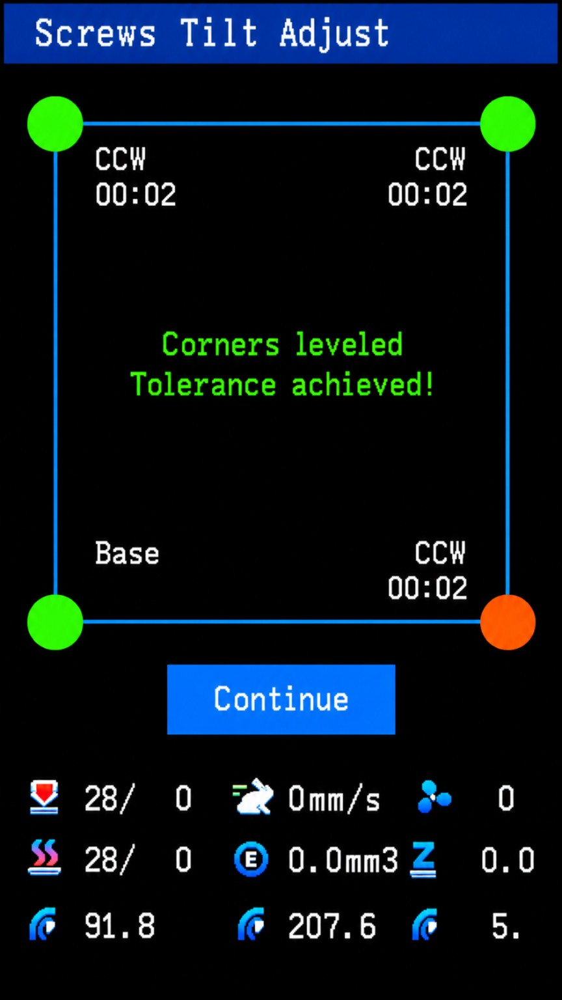
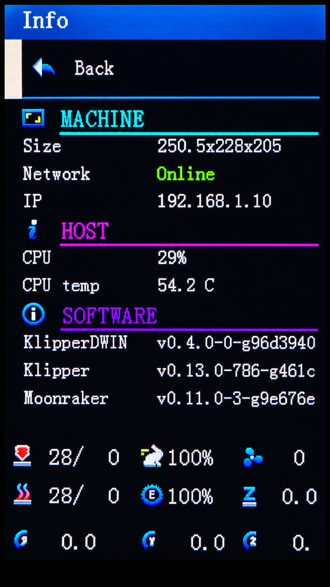
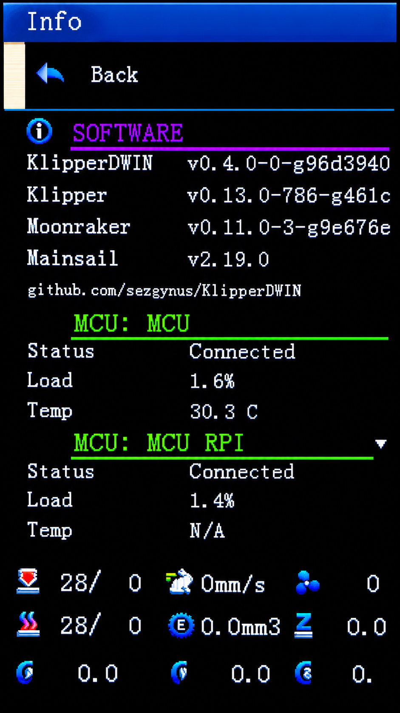
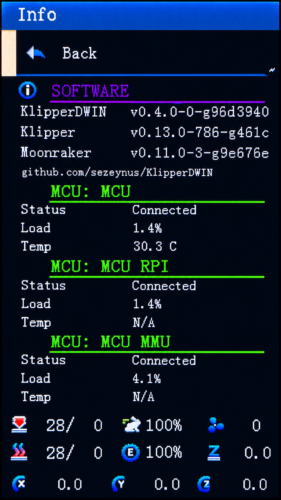
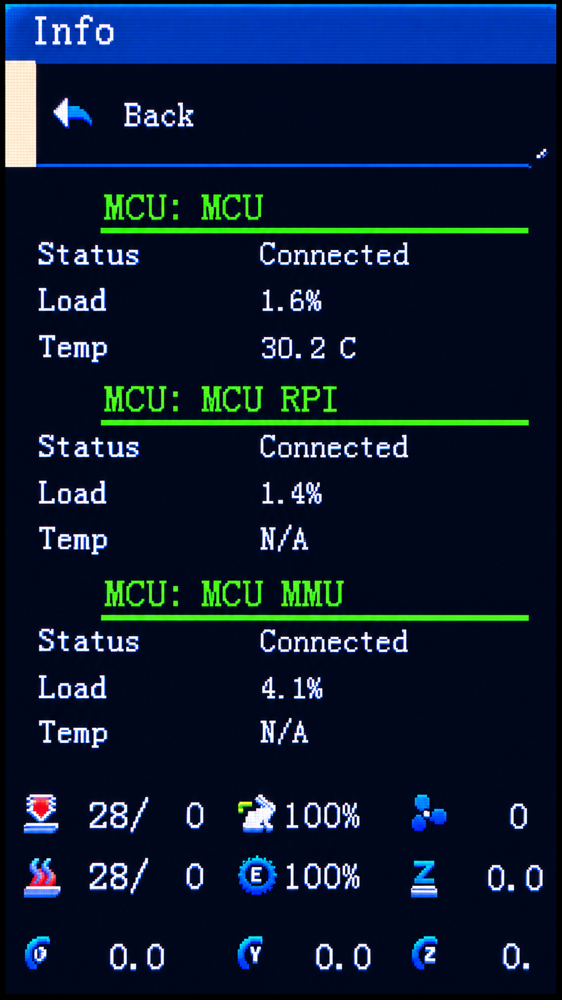
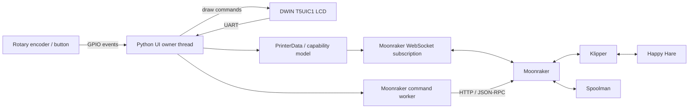

# DWIN T5UIC1 LCD — Klipper / Moonraker UI

<p align="center">
  <strong>A standalone Python UI for DWIN T5UIC1-based 3D-printer displays, built around Klipper and Moonraker.</strong>
</p>

<p align="center">
  <a href="README.md"></a>
  <a href="README_TR.md"></a>
</p>

<p align="center">
  
  
  
  
  
  
  
</p>

## What this project is

This project turns the common 4.3-inch DWIN T5UIC1 rotary-encoder display used on printers such as the Ender 3 V2 into a local Klipper control panel.

The application runs on a Raspberry Pi, talks to the display over UART, reads the encoder through GPIO, and communicates with the printer through Moonraker HTTP/WebSocket APIs. It does not require an OctoPrint compatibility layer or a direct Klipper Unix-socket integration.

It has grown beyond a small compatibility patch: the current codebase includes a dedicated Moonraker client/subscription layer, capability-driven menus, command/result tracking, safe input routing, runtime motion controls, live jogging, probe calibration, Mainsail-synchronized temperature presets, Happy Hare MMU visualization, Spoolman remaining-filament data, case-light control, UART recovery, and a regression-test suite.

## Highlights

- Native Moonraker HTTP + WebSocket integration
- Automatic discovery of available Klipper objects and capabilities
- Main-screen live dashboard for temperatures, fan, speed, flow, Z offset and XYZ
- File browser and print start flow with confirmation tracking
- Print screen with progress, elapsed/remaining time, pause/resume, stop and tune
- X/Y/Z/E movement with machine-limit validation
- Optional Live Jog mode
- Runtime motion tuning for max velocity, max acceleration, square-corner velocity and minimum cruise ratio
- Runtime Z-offset control
- Four-corner screws tilt calibration with Klipper turn-direction guidance
- Bed mesh calibration, colored height maps and saved-profile viewing
- Probe calibration wizard with explicit TESTZ steps and guarded SAVE_CONFIG
- Automatic Mainsail temperature-preset discovery, editing and write-back
- Optional case-light UI through an M355 macro
- Happy Hare MMU visualization on the home screen
- Per-gate filament colors and MMU unit name
- Live lane indicators driven by Happy Hare exit-LED colors
- Spoolman remaining-filament percentages per MMU gate
- Automatic black/white lane-number contrast for readable LED colors
- Resilient UART handshake and reconnect behavior
- Dedicated command worker and connection-epoch protection
- Encoder acceleration with event-queue based input routing
- Installer-configured `KlipperDWIN.service` service
- Python unit/regression tests

## Project status

- ✅ **Moonraker integration** — native HTTP + WebSocket communication.
- ✅ **Capability-driven UI** — dynamic menus and live printer dashboard.
- ✅ **Print workflow** — file browser, print-state tracking and print controls.
- ✅ **Printer controls** — Tune, Prepare, Move / Live Jog and runtime Motion controls.
- ✅ **Temperature & presets** — temperature controls with dynamically discovered Mainsail presets that can be edited and saved from the LCD.
- ✅ **Case Light** — control through a compatible `M355` macro.
- ✅ **Happy Hare visualization** — MMU gate colors and exit-LED state on the Home screen.
- ✅ **Spoolman integration** — remaining-filament percentage per MMU gate.
- ✅ **Encoder power-on** — printer power-on through a Moonraker power device.
- ✅ **Installation & updates** — interactive configuration, systemd service and Moonraker Update Manager integration.
- ✅ **Reliability** — UART recovery, guarded command execution and regression tests.
- ✅ **Probe Calibration** — correct `PROBE_CALIBRATE` / `TESTZ` flow, manual-probe state tracking, Z adjustment, `ACCEPT`, `ABORT` and guarded `SAVE_CONFIG` handling.
- ✅ **Screws Tilt Adjust** — `screws_tilt_adjust` support, `SCREWS_TILT_CALCULATE`, graphical screw positions and calculated CW/CCW adjustment guidance.
- ✅ **Bed Mesh Visualization & Control** — `BED_MESH_CALIBRATE`, a colored Z grid, guarded profile saving and saved-profile viewing without changing the active mesh.
- 🛠️ **Happy Hare MMU Control** — dedicated MMU control menu in addition to the current Home-screen visualization.
- 🛠️ **Happy Hare Multi-Unit Support** — dynamic MMU unit and LED-source discovery instead of the current fixed `unit0_mmu_exit_leds` source.
- 🛠️ **Hardware Validation** — expand physical testing across additional DWIN T5UIC1 and Klipper configurations.

## Installation

### Requirements

- Raspberry Pi or compatible Linux SBC with accessible UART + GPIO
- Klipper and Moonraker
- DWIN T5UIC1-compatible display/asset set

### Automated installation

Clone the master branch to the standard location and run the installer:

```bash
cd ~
git clone https://github.com/sezgynus/KlipperDWIN.git
cd ~/KlipperDWIN
./install.sh
```

The installer:

- installs the required system and Python dependencies
- creates the Python virtual environment at `~/klipperdwin-env`, outside the Git repository
- creates and enables the `KlipperDWIN.service` systemd service
- runs an interactive first-time configuration and stores the result under `~/.config/KlipperDWIN`
- adds `KlipperDWIN` to Moonraker's allowed-services file
- creates `KlipperDWIN.conf` next to `moonraker.conf` and includes it automatically
- registers `[update_manager KlipperDWIN]` so Mainsail can check and install updates from the repository's `master` branch
- configures Moonraker to update Python requirements when `requirements.txt` changes

Moonraker's `dev` update channel follows the latest commit on the configured primary branch. The repository itself is kept free of runtime configuration and virtualenv files so Moonraker can manage it as a clean Git repository.

If Moonraker uses a non-standard configuration path, run:

```bash
MOONRAKER_CONFIG=/path/to/moonraker.conf ./install.sh
```

The first installation prompts for the hardware-facing settings. Press Enter to accept the defaults:

```text
Moonraker URL [http://127.0.0.1:7125]:
Serial port [/dev/ttyS0]:
Encoder A GPIO (BCM) [21]:
Encoder B GPIO (BCM) [19]:
Encoder button GPIO (BCM) [20]:
Moonraker power device [Printer]:
Power-on button hold time (ms, 0 = immediate) [2000]:
```

To change these settings later, run:

```bash
cd ~/KlipperDWIN
./configure.sh
```

Existing configuration is preserved when `install.sh` is run again. `configure.sh` shows the current values as defaults, writes `~/.config/KlipperDWIN/KlipperDWIN.env`, and can restart the service after saving.

The interactive configuration covers the Moonraker endpoint, LCD UART, encoder GPIO pins, encoder button GPIO, Moonraker power-device name, and the power-on hold time. `DWIN_POWER_ON_HOLD_MS` is expressed in milliseconds; the default is `2000`, while `0` requests printer power immediately when the encoder button is pressed.

### Updating with Moonraker / Mainsail

The installer registers KlipperDWIN with Moonraker Update Manager automatically. After Moonraker reloads the generated `KlipperDWIN.conf`, KlipperDWIN appears in Mainsail's **Machine → Update Manager** together with the other managed components.

Use **Refresh** to check for a newer revision and **Update** on the KlipperDWIN entry to install it. Moonraker updates the Git checkout, refreshes Python requirements when needed, and restarts the managed `KlipperDWIN` service. User configuration is kept outside the repository in `~/.config/KlipperDWIN`, so normal Update Manager updates do not overwrite it.

The updater follows the repository's `master` branch. Version tags provide the readable version base shown by Moonraker/Mainsail; commits after a tag may be displayed in a form such as `v0.2.1-1-gabcdef12`.

> [!NOTE]
> Use `./configure.sh` for configuration changes. Do not edit tracked repository files for local hardware settings, because Moonraker expects the managed Git checkout to remain clean.

## Supported hardware

The current UI targets the DWIN T5UIC1 panel family used by the Ender 3 V2 layout and its rotary encoder.

Typical wiring:

| Display | Raspberry Pi |
|---|---|
| RX | GPIO14 / UART TX |
| TX | GPIO15 / UART RX |
| Encoder A | GPIO21 by default |
| Encoder B | GPIO19 by default |
| Encoder Enter | GPIO20 by default |
| VCC | 5 V |
| GND | GND |

BCM numbering is used. Encoder/button pins and the serial device are configurable, so the defaults are not a requirement.

> [!IMPORTANT]
> Raspberry Pi UART routing varies by Pi model and OS configuration. Verify which device is actually routed to GPIO14/15 instead of assuming that `/dev/ttyAMA0` or `/dev/serial0` is always correct.

Existing wiring photos and diagrams are available in the [images](images/) directory.

## UI tour

Each section below describes the current screen behavior using captures from the current UI.

### 1. Home screen

<p align="center"></p>

The home screen is the main navigation hub, with four icons per page. With bed-mesh calibration available, the first page contains Print, Prepare, Control and Leveling; rotating the encoder past Leveling opens the second page and selects Info. Rotating back returns to Leveling. Without calibration support, Info is the fourth icon on the first page. Empty slots cannot be selected. The logo/MMU panel and live dashboard remain fixed while paging; returning from Info restores its Home page.

A compact live dashboard remains visible below the menu area and reports the current hotend/bed state when available, print-speed factor, fan, flow, runtime Z offset and live X/Y/Z coordinates.

When Happy Hare is not detected, the normal logo area is shown. When an MMU is available, that area becomes the live MMU visualization described below.

### 2. Happy Hare MMU visualization

There is no separate MMU control screen yet. The current Happy Hare integration is displayed directly on the Home screen shown above. It adapts to the reported gate count and uses Happy Hare state instead of a hard-coded four-spool model.

For each gate it can show:

- a compact side-view spool graphic
- filament color from Happy Hare gate metadata
- remaining percentage fetched from the gate's Spoolman spool ID
- lane number
- live lane-indicator color from the Happy Hare exit LED chain
- MMU unit display name when exposed by `mmu_machine`

LED hue is normalized before RGB565 conversion, so deliberately dim physical LEDs remain visible on the LCD while keeping their color. Fully off LEDs remain black. Lane-number text automatically switches between black and white for contrast.

The current Home-screen implementation subscribes to `unit0_mmu_exit_leds` for live exit-LED colors. This is intentionally explicit today and can be generalized for multi-unit/alternative-segment setups later.

### 3. Print file browser

<p align="center"></p>

The file browser uses Moonraker's file list and keeps a cached, sorted path snapshot for responsive encoder navigation.

Selection is preserved across list refreshes where possible. Deleting/reordering files cannot silently move the cursor to an unrelated entry. Print start is guarded against duplicate presses and waits for both command acceptance and subscribed print-state confirmation before opening the print screen.

### 4. Printing screen

<p align="center"></p>

The printing screen provides:

- file name
- progress bar and percentage
- elapsed print time
- estimated remaining time
- Tune
- Pause / Resume
- Stop

Paused, completed, cancelled and error states are handled explicitly. Completion follows Klipper's `print_stats.state`; a rounded 100% value alone does not mark a running print as finished.

### 5. Tune menu

<p align="center"></p>

Tune is the live-print adjustment menu. Rows appear only when the matching printer capability exists. Depending on the machine, it can expose hotend target, bed target, fan, print speed, runtime Z offset and other active controls.

Values remain synchronized with Moonraker status. An editor keeps its local target while open, then returns to subscribed state after confirmation.

### 6. Prepare menu

<p align="center"></p>

Prepare contains printer setup actions such as homing, movement, cooldown/preheat and runtime Z-offset access. Entries are built from discovered Klipper capabilities rather than assuming every printer has the same heaters, fan, probe or leveling hardware.

#### Bed Mesh Calibrate / Mesh Viewer

When `[bed_mesh]` and a probe are available, **Prepare → Bed Mesh Calibrate** starts a measurement. **Leveling** on the Home screen opens the same calibration flow. Missing homed axes trigger `G28` first, followed by `BED_MESH_CALIBRATE PROFILE=lcd_mesh_N ADAPTIVE=0`. The session chooses an unused `lcd_mesh_N` name to avoid overwriting existing profiles. Calibration is blocked during printing, pause, a manual-probe session, another LCD calibration, jog recovery or unrelated pending config changes.

The measurement screen shows a grid, point values available from probe responses and **Cancel**. These live values are marked **raw Z**; repeated probe samples update the same point. The result screen opens only after confirmed command completion and a fresh `bed_mesh` query. Klipper's `probed_matrix` values appear in circles whose color and size depend on height, with minimum/maximum Z and **Save / Continue** below. Low Y is at the bottom and high Y at the top. **Continue** returns to the menu that opened calibration.

**Save** opens a confirmation showing the profile name and the Klipper restart; **Back** is selected by default. After confirmation, the current mesh, profile and `save_config_pending_items` are queried again. `SAVE_CONFIG` is sent only when the pending changes match the profile measured by this session; other settings are not saved together. **Continue** does not persist the profile; the profile created by Klipper during calibration remains available for the current session. Repeated measurements before saving reuse the same LCD profile name. A lost response during restart is not treated as successful persistence; check the profile again.

**Control → Mesh Viewer** lists **Current Mesh** and profiles from Klipper's `bed_mesh.profiles`. Selecting a profile with the encoder queries fresh data and opens that profile's map. This does not send `BED_MESH_PROFILE LOAD` or change the active mesh. **Continue** returns to the profile list. The list scrolls; empty, deleted or invalid meshes are never replaced with an earlier map.

Klipper has no separate command to immediately cancel normal calibration, so **Cancel → Stop** confirmation uses Moonraker's `printer.emergency_stop` request. The confirmation explicitly states that Klipper will enter shutdown; `FIRMWARE_RESTART` is required to resume operation. Measurement, stop and save commands are never replayed automatically.

#### Screws Tilt Adjust

<p align="center"></p>

Success instructions are green; required-adjustment instructions are neutral white.

When `[screws_tilt_adjust]` is configured, **Prepare → Screws Tilt Adjust → Calculate** starts Klipper's `SCREWS_TILT_CALCULATE`. This view supports four distinct corner screws and a configured probe. It places screws from their configured XY coordinates, independently of their numbering. Missing homed axes trigger `G28` first; calculation is blocked during printing, pause, another manual-probe session, or unresolved jog recovery.

The result uses a four-corner layout: each corner has a colored marker with large labels beside it on the black background: **Base**, or **CW/CCW** above **turns:minutes**. `01:20` means one full turn plus 20/60 of a turn. The central instruction selects the non-reference screw with the largest required rotation and displays its corner, direction and amount. Directions and amounts come directly from Klipper; the UI does not recalculate thread pitch. **Corners leveled / Tolerance achieved!** requires a peak-to-peak measured height difference below **0.05 mm**. Otherwise an adjustment is shown. Turn values rounded to `00:60` by Klipper are displayed as `01:00`.

Encoder input is locked during calculation. **Continue** returns to the submenu, where **Calculate** can run another measurement. Results are queried after confirmed command completion, so identical repeated measurements are still fresh. Failed, disconnected or unconfirmed measurements never display the previous result as success; commands are never replayed automatically. No `SAVE_CONFIG` or automatic screw adjustment is performed. Configurations with three, five or more screws are rejected rather than forced into the four-corner view.

### 7. Move / Live Jog

<p align="center"></p>

The movement screen displays live X/Y/Z positions and E when an extruder is available.

Normal edit mode changes a local target and submits a guarded move. Live Jog can apply encoder movement immediately for responsive positioning. Jog commands:

- require the selected axis to be homed
- respect discovered physical travel limits
- reject movement while printing/paused
- validate extrusion against `can_extrude` and the configured extrusion distance
- save and restore Klipper G-code state around relative movement
- block further motion if state restoration cannot be confirmed

The position source is Klipper's command-space `gcode_move.position`, so the UI remains consistent with runtime transforms and offsets.

### 8. Control menu

<p align="center"></p>

Control is the configuration-oriented menu. Available rows are capability-driven and can lead to temperature presets, motion controls, Mesh Viewer, probe calibration, case light and information pages.

### 9. Temperature / presets

<p align="center"></p>

Temperature controls are generated from installed devices: hotend, heated bed and part fan are independently optional.

Temperature presets are discovered automatically from Mainsail through Moonraker's database. Preset names and enabled hotend/bed targets are reflected dynamically in both the Prepare and Temperature menus, so the LCD follows presets added, removed or changed in Mainsail without requiring a fixed PLA/ABS list.

Preset hotend and bed values can also be edited on the LCD and saved back to the corresponding Mainsail preset. Preset synchronization does not include part-fan values because Mainsail temperature presets do not define a fan setting. Applying a preset validates the available heater targets before heating; saving preset settings by itself does not heat the printer.

If the Mainsail preset database is unavailable, the legacy local preset store remains available as a fallback. `--settings-file` controls that fallback store; once Mainsail presets are successfully available, Mainsail is authoritative.

### 10. Motion (runtime)

<p align="center"></p>

The Motion screen edits Klipper's runtime velocity limits through `SET_VELOCITY_LIMIT`:

- max velocity
- max acceleration
- square-corner velocity
- minimum cruise ratio, when supported

Unsupported fields are omitted. These are runtime changes; the screen does not automatically persist them into printer configuration.

### 11. Case Light

<p align="center"></p>

If a `gcode_macro M355` capability is detected, the Control menu can expose case-light control.

The page provides:

- on/off state
- 0–100% brightness editor
- synchronization from the macro's reported state

Brightness is converted to the macro's 0–255 scale internally.

### 12. Info

<p align="center">
  
  
</p>
<p align="center">
  
  
</p>

The Info screen is a live, encoder-scrollable system overview organized into color-coded Machine, Host, Software and MCU sections. It shows the configured machine dimensions, network state and active IPv4 address; host CPU load and temperature; installed KlipperDWIN, Klipper, Moonraker and Mainsail versions; and the project address `github.com/sezgynus/KlipperDWIN`.

Every connected Klipper MCU is listed separately with connection state and live MCU load. MCU temperature is also shown when Klipper exposes a `temperature_mcu` source for that controller; otherwise the value is reported as `N/A`. The network state is highlighted green while online and red while offline. Long content can be browsed vertically with the encoder without overlapping the persistent printer-status area.

KlipperDWIN uses Moonraker Update Manager's full Git version string when available (for example `v0.4.0-N-gXXXX`), so commits after a release tag remain identifiable.

## Dynamic capability detection

Menus are not built from a fixed printer template. At startup/reconnect the application discovers Moonraker/Klipper objects and derives capabilities from the actual machine.

Examples include:

- hotend present or absent
- heated bed present or absent
- part-cooling fan present or absent
- probe/manual-probe support
- bed-mesh/leveling support
- `screws_tilt_adjust` configuration
- motion fields supported by the active Klipper version
- case-light macro availability
- Happy Hare MMU objects
- MMU unit metadata and exit LEDs

This allows the same UI code to avoid showing controls that cannot work on the connected printer.

## Happy Hare integration

Happy Hare support is automatic when the required Klipper objects are present.

The UI currently consumes:

- `mmu` — gate count, selected gate, gate status, gate colors, spool IDs and filament state
- `mmu_machine` — unit name/display metadata
- `unit0_mmu_exit_leds` — live per-gate exit LED colors

No MMU-specific screen is required to obtain the home-screen visualization; it appears when the state is available.

## Spoolman integration

Happy Hare supplies each gate's `gate_spool_id`. The application uses Moonraker's Spoolman proxy to retrieve the corresponding spool and calculate remaining percentage from weight data.

This keeps percentages gate-specific instead of relying on a single globally active Spoolman spool.

If Spoolman data is unavailable, the rest of the MMU panel continues to work.

## Case-light macro contract

Case-light support is optional and appears when `gcode_macro M355` exists.

The UI sends:

```text
M355 S0/1
M355 P0..255
```

For state synchronization it expects a query response containing the equivalent of:

```text
Light is ON, Brightness=128
```

Adapt your macro to that contract if you want bidirectional case-light status.

## Encoder power-on

When Moonraker has a configured power device, the encoder button can turn it on even while Klipper or the LCD UART is offline. The device name defaults to `Printer` and can be changed with `DWIN_POWER_DEVICE`. The hold duration is controlled by `DWIN_POWER_ON_HOLD_MS`: the default `2000` requires a 2-second hold, and `0` requests power-on immediately on the press edge.

## Architecture

<details>
<summary><strong>Show architecture</strong></summary>



The display thread owns rendering and menu state. GPIO callbacks only enqueue immutable input events. Printer state comes from a merged, immutable Moonraker subscription snapshot; HTTP commands run on a separate serialized worker. Long operations such as Screws Tilt and Bed Mesh use completion-tracked WebSocket RPC requests without blocking telemetry or UI rendering.

</details>

## Moonraker connection model

<details>
<summary><strong>Show connection details</strong></summary>

Default endpoint:

```text
http://127.0.0.1:7125
```

The application uses:

- HTTP for commands and bounded request/response operations
- Moonraker WebSocket JSON-RPC for printer object discovery, live subscriptions and completion tracking of long Screws Tilt / Bed Mesh commands
- connection epochs so queued commands from an old connection cannot run after reconnect
- automatic WebSocket reconnect
- ping/pong checks for silent disconnect detection
- immutable merged printer-state snapshots
- command futures and retained error acknowledgement instead of blind retries

Optional API-key authentication is supported through `MOONRAKER_API_KEY`. Empty keys are not sent.

</details>

## UART preparation

<details>
<summary><strong>Show UART setup</strong></summary>

Use `raspi-config` to disable the serial login console and enable serial hardware, then reboot.

```bash
sudo raspi-config
```

Verify the UART assigned to the physical pins for your Pi model. Bluetooth overlays and boot configuration paths differ across Raspberry Pi generations and OS releases, so this project does not prescribe one universal overlay.

</details>

## Run manually

<details>
<summary><strong>Show manual run options</strong></summary>

Example matching the repository defaults:

```bash
cd ~/KlipperDWIN

~/klipperdwin-env/bin/python run.py \
  --serial-port /dev/ttyS0 \
  --encoder-pins 21 19 \
  --button-pin 20 \
  --moonraker-url http://127.0.0.1:7125
```

Use the actual UART and GPIO pins for your installation.

Available configuration:

| Environment | CLI | Default |
|---|---|---|
| `MOONRAKER_URL` | `--moonraker-url` | `http://127.0.0.1:7125` |
| `MOONRAKER_API_KEY` | environment only | empty |
| `DWIN_REQUEST_TIMEOUT` | `--request-timeout` | 5 s |
| `DWIN_SERIAL_PORT` | `--serial-port` | `/dev/ttyS0` |
| `DWIN_ENCODER_PINS` | `--encoder-pins A B` | `21 19` |
| `DWIN_BUTTON_PIN` | `--button-pin` | `20` |
| `DWIN_SETTINGS_FILE` | `--settings-file` | `~/.config/KlipperDWIN/presets.json` after installer configuration |
| `DWIN_POWER_DEVICE` | `--power-device` | `Printer` |
| `DWIN_POWER_ON_HOLD_MS` | `--power-on-hold-ms` | `2000` ms |

</details>

## Run at boot with systemd

<details>
<summary><strong>Show systemd setup</strong></summary>

`./install.sh` fills the repository's `simpleLCD.service` template with the installation user and home directory, installs it as `/etc/systemd/system/KlipperDWIN.service`, and enables it. Run the installer to create or update the service rather than copying the template directly:

```bash
cd ~/KlipperDWIN
./install.sh
sudo systemctl status KlipperDWIN.service --no-pager
sudo systemctl restart KlipperDWIN.service
sudo journalctl -u KlipperDWIN.service -f
```

The service runs as the installation user with the `~/klipperdwin-env` virtual environment, reads settings from `~/.config/KlipperDWIN/KlipperDWIN.env`, restarts on failure and logs to journald. Use `./configure.sh` to change settings. The installer adds existing `dialout`/`gpio` groups to the service; confirm that the user can access the actual UART and gpiochip devices.

</details>

## Reliability and safety behavior

<details>
<summary><strong>Show reliability details</strong></summary>

The project intentionally avoids optimistic UI state for printer-changing actions.

- HTTP commands are serialized on a dedicated worker; long calibration RPC requests do not block telemetry.
- Failed commands are not replayed automatically.
- Connection changes invalidate queued commands from the old epoch.
- Offline/old input events are discarded.
- Movement validates homing, bounds and printer state.
- Jogging preserves/restores G-code state.
- An unconfirmed jog-state restore blocks additional motion.
- Print start waits for both command result and subscribed print state.
- Pause/resume/cancel wait for the corresponding subscribed state.
- Probe calibration waits for manual-probe state changes.
- Screws Tilt and Bed Mesh wait for confirmed command completion followed by a fresh result query.
- Viewing mesh profiles never sends a LOAD command.
- Bed Mesh saving accepts only pending config changes belonging to the measured profile.
- UART writes fail closed on short writes/errors.
- Panel reconnect redraws state but never replays printer commands.

A timeout can still mean that a command reached the printer while its response was lost. Always inspect actual printer state before repeating an uncertain action.

</details>

## UART/display layer

<details>
<summary><strong>Show low-level display details</strong></summary>

The DWIN transport implements bounded startup handshakes, incremental ACK parsing, full-frame writes and reconnect attempts.

Rendering includes:

- text sanitation/transliteration for stock ASCII fonts
- bounded string payloads
- signed/fractional numeric formatting
- overflow markers instead of silently truncating values
- icon/frame copy helpers
- RGB565 colors
- backlight control
- update coalescing to avoid unnecessary UART traffic

See [LCD asset notes](docs/lcd-assets.md) and [source audit](docs/source-audit.md) for low-level details.

</details>

## Tests

<details>
<summary><strong>Show test instructions</strong></summary>

Run the full isolated test suite with:

```bash
cd ~/KlipperDWIN
~/klipperdwin-env/bin/python -m unittest discover -s tests -v
```

The tests cover the Moonraker client/subscription layer, printer-state normalization, capability detection, menu behavior, input routing, command handling, movement safety, UART framing/render helpers, MMU data and other regressions.

Screws Tilt regressions cover WebSocket RPC completion, fresh and identical repeated results, corner placement, tolerance, instruction colors and error/disconnect flows.

Bed Mesh regressions cover measurement/result tracking, profile selection without changing the active mesh, sample deduplication, save/stop confirmations, rejection of unrelated config changes, grid orientation, text bounds and UART reconnect without command replay.

Unit tests do not replace physical validation on a printer.

</details>

## Current scope / known limitations

<details>
<summary><strong>Show known limitations</strong></summary>

- The display UI is designed around the existing 272×480 DWIN asset/layout family.
- Live Happy Hare lane colors currently use the explicitly named `unit0_mmu_exit_leds` object.
- Multi-unit MMU LED-source selection is not generalized yet.
- Case-light support depends on a compatible `M355` macro.
- Runtime Motion values are not automatically persisted to printer configuration.
- The Screws Tilt view requires four distinct corner screws; its success threshold is a fixed 0.05 mm peak-to-peak height difference.
- Bed Mesh supports matrices up to 25×25 points. Dense grids omit some labels to avoid text overlap; every point is drawn and included in the min/max calculation.
- Live Bed Mesh points depend on standard probe console responses. Scan/probe methods without these responses display the final map after measurement completes.
- Bed Mesh Cancel confirmation requires Klipper shutdown; persistent Save confirmation requires a Klipper restart.
- Hardware compatibility outside the tested DWIN/encoder wiring should be validated before relying on motion controls.

</details>

## Project history and credits

<details>
<summary><strong>Show project history and credits</strong></summary>

This repository retains its open-source lineage and Git history.

The project originated from the DWIN T5UIC1 LCD work in:

- [odwdinc/DWIN_T5UIC1_LCD](https://github.com/odwdinc/DWIN_T5UIC1_LCD)
- [bustedlogic/DWIN_T5UIC1_LCD](https://github.com/bustedlogic/DWIN_T5UIC1_LCD)

The current project has since been substantially reworked around Klipper/Moonraker, a new state/command architecture, dynamic capabilities, safer input handling, expanded controls, MMU/Spoolman support and regression testing.

Independence does not erase attribution: original copyright notices, commit history and GPL obligations remain applicable.

Additional projects used or integrated by this software include:

- [Klipper](https://github.com/Klipper3d/klipper)
- [Moonraker](https://github.com/Arksine/moonraker)
- [Happy Hare](https://github.com/moggieuk/Happy-Hare)
- [Spoolman](https://github.com/Donkie/Spoolman)

</details>

## Contributing

<details>
<summary><strong>Show contribution guidelines</strong></summary>

Issues and pull requests are welcome. For UI changes, include the printer capability/setup involved and, where possible, add or update a regression test in the same change.

For hardware/UI bugs, useful reports include:

- Raspberry Pi model and OS
- UART device
- encoder/button BCM pins
- Klipper + Moonraker versions
- relevant optional component (probe, MMU, Spoolman, M355, etc.)
- log excerpt
- panel photo when the problem is visual

</details>

## License

GNU General Public License v3.0. See [LICENSE](LICENSE).

---

<p align="center">
  <strong>Klipper on the printer. Moonraker on the network. DWIN at your fingertips.</strong>
</p>
