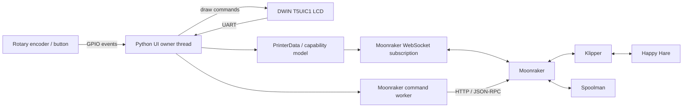
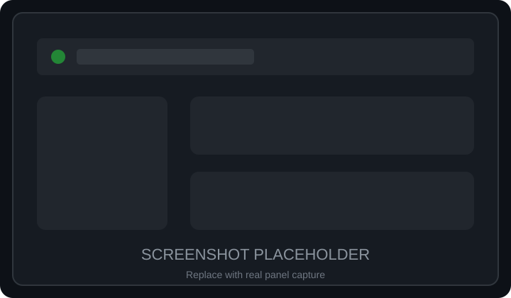

# DWIN T5UIC1 LCD — Klipper / Moonraker UI

<p align="center">
  <strong>A standalone Python UI for DWIN T5UIC1-based 3D-printer displays, built around Klipper and Moonraker.</strong>
</p>

<p align="center">
  <a href="README.md"></a>
  <a href="README_TR.md"></a>
</p>

<p align="center">
  
  
  
  
  
  
  
</p>

> [!NOTE]
> The screenshots in this README are temporary placeholders. Real panel captures will replace them after the UI photo set is prepared.

## What this project is

This project turns the common 4.3-inch DWIN T5UIC1 rotary-encoder display used on printers such as the Ender 3 V2 into a local Klipper control panel.

The application runs on a Raspberry Pi, talks to the display over UART, reads the encoder through GPIO, and communicates with the printer through Moonraker HTTP/WebSocket APIs. It does not require an OctoPrint compatibility layer or a direct Klipper Unix-socket integration.

It has grown beyond a small compatibility patch: the current codebase includes a dedicated Moonraker client/subscription layer, capability-driven menus, command/result tracking, safe input routing, runtime motion controls, live jogging, probe calibration, persistent presets, Happy Hare MMU visualization, Spoolman remaining-filament data, case-light control, UART recovery, and a regression-test suite.

## Highlights

- Native Moonraker HTTP + WebSocket integration
- Automatic discovery of available Klipper objects and capabilities
- Main-screen live dashboard for temperatures, fan, speed, flow, Z offset and XYZ
- File browser and print start flow with confirmation tracking
- Print screen with progress, elapsed/remaining time, pause/resume, stop and tune
- X/Y/Z/E movement with machine-limit validation
- Optional Live Jog mode
- Runtime motion tuning for max velocity, max acceleration, square-corner velocity and minimum cruise ratio
- Runtime Z-offset control
- Probe calibration wizard with explicit TESTZ steps and guarded SAVE_CONFIG flow
- PLA/ABS preset editing and persistent JSON storage
- Optional case-light UI through an M355 macro
- Happy Hare MMU panel on the home screen
- Per-gate filament colors and MMU unit name
- Live lane indicators driven by Happy Hare exit-LED colors
- Spoolman remaining-filament percentages per MMU gate
- Automatic black/white lane-number contrast for readable LED colors
- Resilient UART handshake and reconnect behavior
- Dedicated command worker and connection-epoch protection
- Encoder acceleration with event-queue based input routing
- systemd service example
- Python unit/regression tests

## Architecture



The display thread owns rendering and menu state. GPIO callbacks only enqueue immutable input events. Printer state comes from a merged, immutable Moonraker subscription snapshot; commands are serialized separately so UI rendering does not depend on blocking HTTP requests.

## Supported hardware

The current UI targets the DWIN T5UIC1 panel family used by the Ender 3 V2 layout and its rotary encoder.

Typical wiring:

| Display | Raspberry Pi |
|---|---|
| RX | GPIO14 / UART TX |
| TX | GPIO15 / UART RX |
| Encoder A | GPIO21 by default |
| Encoder B | GPIO19 by default |
| Encoder Enter | GPIO13 by default |
| VCC | 5 V |
| GND | GND |

BCM numbering is used. Encoder/button pins and the serial device are configurable, so the defaults are not a requirement.

> [!IMPORTANT]
> Raspberry Pi UART routing varies by Pi model and OS configuration. Verify which device is actually routed to GPIO14/15 instead of assuming that `/dev/ttyAMA0` or `/dev/serial0` is always correct.

Existing wiring photos and diagrams are available in the [images](images/) directory.

## UI tour

Each section below describes the current screen behavior. The placeholder image will be replaced with a real LCD photograph/capture.

### 1. Home screen

<p align="center"></p>

The home screen is the main navigation hub. It exposes Print, Prepare, Control and either Leveling or Info depending on discovered printer capabilities.

A compact live dashboard remains visible below the menu area and reports the current hotend/bed state when available, print-speed factor, fan, flow, runtime Z offset and live X/Y/Z coordinates.

When Happy Hare is not detected, the normal logo area is shown. When an MMU is available, that area becomes the live MMU panel described below.

### 2. Happy Hare MMU panel

<p align="center"></p>

The MMU panel is integrated directly into the home screen. It adapts to the reported gate count and uses Happy Hare state instead of a hard-coded four-spool model.

For each gate it can show:

- a compact side-view spool graphic
- filament color from Happy Hare gate metadata
- remaining percentage fetched from the gate's Spoolman spool ID
- lane number
- live lane-indicator color from the Happy Hare exit LED chain
- MMU unit display name when exposed by `mmu_machine`

LED hue is normalized before RGB565 conversion, so deliberately dim physical LEDs remain visible on the LCD while keeping their color. Fully off LEDs remain black. Lane-number text automatically switches between black and white for contrast.

The current implementation subscribes to `unit0_mmu_exit_leds` for live exit-LED colors. This is intentionally explicit today and can be generalized for multi-unit/alternative-segment setups later.

### 3. Print file browser

<p align="center"></p>

The file browser uses Moonraker's file list and keeps a cached, sorted path snapshot for responsive encoder navigation.

Selection is preserved across list refreshes where possible. Deleting/reordering files cannot silently move the cursor to an unrelated entry. Print start is guarded against duplicate presses and waits for both command acceptance and subscribed print-state confirmation before opening the print screen.

### 4. Printing screen

<p align="center"></p>

The printing screen provides:

- file name
- progress bar and percentage
- elapsed print time
- estimated remaining time
- Tune
- Pause / Resume
- Stop

Paused, completed, cancelled and error states are handled explicitly. Completion follows Klipper's `print_stats.state`; a rounded 100% value alone does not mark a running print as finished.

### 5. Tune menu

<p align="center"></p>

Tune is the live-print adjustment menu. Rows appear only when the matching printer capability exists. Depending on the machine, it can expose hotend target, bed target, fan, print speed, runtime Z offset and other active controls.

Values remain synchronized with Moonraker status. An editor keeps its local target while open, then returns to subscribed state after confirmation.

### 6. Prepare menu

<p align="center"></p>

Prepare contains printer setup actions such as homing, movement, cooldown/preheat and runtime Z-offset access. Entries are built from discovered Klipper capabilities rather than assuming every printer has the same heaters, fan, probe or leveling hardware.

### 7. Move / Live Jog

<p align="center"></p>

The movement screen displays live X/Y/Z positions and E when an extruder is available.

Normal edit mode changes a local target and submits a guarded move. Live Jog can apply encoder movement immediately for responsive positioning. Jog commands:

- require the selected axis to be homed
- respect discovered physical travel limits
- reject movement while printing/paused
- validate extrusion against `can_extrude` and the configured extrusion distance
- save and restore Klipper G-code state around relative movement
- block further motion if state restoration cannot be confirmed

The position source is Klipper's command-space `gcode_move.position`, so the UI remains consistent with runtime transforms and offsets.

### 8. Control menu

<p align="center"></p>

Control is the configuration-oriented menu. Available rows are capability-driven and can lead to temperature presets, motion controls, probe calibration, case light and information pages.

### 9. Temperature / presets

<p align="center"></p>

Temperature controls are generated from installed devices: hotend, heated bed and part fan are independently optional.

PLA and ABS profiles can be edited locally and saved to a versioned JSON file. Applying a profile validates every available target first, then sends one script for the installed devices. Saving a preset does not heat the printer.

Default storage:

```text
$XDG_CONFIG_HOME/dwin-lcd/presets.json
```

or:

```text
~/.config/dwin-lcd/presets.json
```

A custom path can be supplied with `--settings-file`.

### 10. Motion (runtime)

<p align="center"></p>

The Motion screen edits Klipper's runtime velocity limits through `SET_VELOCITY_LIMIT`:

- max velocity
- max acceleration
- square-corner velocity
- minimum cruise ratio, when supported

Unsupported fields are omitted. These are runtime changes; the screen does not automatically persist them into printer configuration.

### 11. Probe calibration wizard

<p align="center"></p>

When the required probe/manual-probe objects are available, Control exposes a guided probe calibration screen.

The wizard deliberately separates each step:

- start `PROBE_CALIBRATE`
- Raise / Lower by 0.1 mm
- Raise / Lower by 0.01 mm
- Accept
- Abort
- Save and restart Klipper only when the expected probe offset is the pending configuration change
- leave unsaved

The UI never assumes an HTTP success means the physical/manual-probe state already changed; it waits for subscribed state confirmation.

### 12. Case Light

<p align="center"></p>

If a `gcode_macro M355` capability is detected, the Control menu can expose case-light control.

The page provides:

- on/off state
- 0–100% brightness editor
- synchronization from the macro's reported state

Brightness is converted to the macro's 0–255 scale internally.

### 13. Info

<p align="center"></p>

The Info screen shows detected machine/build information in the familiar DWIN layout. It is used when a dedicated one-step leveling entry is not occupying the fourth home-screen slot.

## Dynamic capability detection

Menus are not built from a fixed printer template. At startup/reconnect the application discovers Moonraker/Klipper objects and derives capabilities from the actual machine.

Examples include:

- hotend present or absent
- heated bed present or absent
- part-cooling fan present or absent
- probe/manual-probe support
- bed-mesh/leveling support
- motion fields supported by the active Klipper version
- case-light macro availability
- Happy Hare MMU objects
- MMU unit metadata and exit LEDs

This allows the same UI code to avoid showing controls that cannot work on the connected printer.

## Moonraker connection model

Default endpoint:

```text
http://127.0.0.1:7125
```

The application uses:

- HTTP for commands and bounded request/response operations
- Moonraker WebSocket JSON-RPC for printer object discovery and live subscriptions
- connection epochs so queued commands from an old connection cannot run after reconnect
- automatic WebSocket reconnect
- ping/pong checks for silent disconnect detection
- immutable merged printer-state snapshots
- command futures and retained error acknowledgement instead of blind retries

Optional API-key authentication is supported through `MOONRAKER_API_KEY`. Empty keys are not sent.

## Installation

### Requirements

- Raspberry Pi or compatible Linux SBC with accessible UART + GPIO
- Python 3.11+
- Klipper
- Moonraker
- DWIN T5UIC1-compatible display/asset set

Install system packages:

```bash
sudo apt update
sudo apt install git python3-venv python3-dev build-essential
```

Clone this development branch:

```bash
sudo git clone --branch refactor/modern-klipper-moonraker \
  https://github.com/sezgynus/DWIN_T5UIC1_LCD.git /opt/dwin-lcd

sudo python3 -m venv /opt/dwin-lcd/.venv
sudo /opt/dwin-lcd/.venv/bin/python -m pip install -r /opt/dwin-lcd/requirements.txt
```

The Python dependencies include GPIOZero, lgpio, pyserial and websocket-client. HTTP uses the Python standard library.

## UART preparation

Use `raspi-config` to disable the serial login console and enable serial hardware, then reboot.

```bash
sudo raspi-config
```

Verify the UART assigned to the physical pins for your Pi model. Bluetooth overlays and boot configuration paths differ across Raspberry Pi generations and OS releases, so this project does not prescribe one universal overlay.

## Run manually

Example matching the repository defaults:

```bash
cd /opt/dwin-lcd

sudo .venv/bin/python run.py \
  --serial-port /dev/ttyAMA0 \
  --encoder-pins 21 19 \
  --button-pin 13 \
  --moonraker-url http://127.0.0.1:7125
```

Use the actual UART and GPIO pins for your installation.

Available configuration:

| Environment | CLI | Default |
|---|---|---|
| `MOONRAKER_URL` | `--moonraker-url` | `http://127.0.0.1:7125` |
| `MOONRAKER_API_KEY` | environment only | empty |
| `DWIN_REQUEST_TIMEOUT` | `--request-timeout` | 5 s |
| `DWIN_SERIAL_PORT` | `--serial-port` | `/dev/ttyAMA0` |
| `DWIN_ENCODER_PINS` | `--encoder-pins A B` | `21 19` |
| `DWIN_BUTTON_PIN` | `--button-pin` | `13` |
| `DWIN_SETTINGS_FILE` | `--settings-file` | user XDG path |

## Run at boot with systemd

A sample unit and environment file are included.

```bash
id -u dwinlcd >/dev/null 2>&1 || \
  sudo useradd --system --user-group \
  --home-dir /var/lib/dwin-lcd --no-create-home \
  --shell /usr/sbin/nologin dwinlcd

sudo install -m 0600 /opt/dwin-lcd/dwin-lcd.env.example /etc/default/dwin-lcd
sudoedit /etc/default/dwin-lcd

sudo install -m 0644 /opt/dwin-lcd/simpleLCD.service \
  /etc/systemd/system/simpleLCD.service

sudo systemctl daemon-reload
sudo systemctl enable --now simpleLCD.service
sudo journalctl -u simpleLCD.service -f
```

The service uses a dedicated account, restarts on failure, stores presets in `/var/lib/dwin-lcd`, and logs to journald. Confirm that the service user has access to the actual UART and gpiochip devices on your OS.

## Happy Hare integration

Happy Hare support is automatic when the required Klipper objects are present.

The UI currently consumes:

- `mmu` — gate count, selected gate, gate status, gate colors, spool IDs and filament state
- `mmu_machine` — unit name/display metadata
- `unit0_mmu_exit_leds` — live per-gate exit LED colors

No MMU-specific screen is required to obtain the home-screen visualization; it appears when the state is available.

## Spoolman integration

Happy Hare supplies each gate's `gate_spool_id`. The application uses Moonraker's Spoolman proxy to retrieve the corresponding spool and calculate remaining percentage from weight data.

This keeps percentages gate-specific instead of relying on a single globally active Spoolman spool.

If Spoolman data is unavailable, the rest of the MMU panel continues to work.

## Case-light macro contract

Case-light support is optional and appears when `gcode_macro M355` exists.

The UI sends:

```text
M355 S0/1
M355 P0..255
```

For state synchronization it expects a query response containing the equivalent of:

```text
Light is ON, Brightness=128
```

Adapt your macro to that contract if you want bidirectional case-light status.

## Reliability and safety behavior

The project intentionally avoids optimistic UI state for printer-changing actions.

- Commands are serialized on a dedicated worker.
- Failed commands are not replayed automatically.
- Connection changes invalidate queued commands from the old epoch.
- Offline/old input events are discarded.
- Movement validates homing, bounds and printer state.
- Jogging preserves/restores G-code state.
- An unconfirmed jog-state restore blocks additional motion.
- Print start waits for both command result and subscribed print state.
- Pause/resume/cancel wait for the corresponding subscribed state.
- Probe calibration waits for manual-probe state changes.
- UART writes fail closed on short writes/errors.
- Panel reconnect redraws state but never replays printer commands.

A timeout can still mean that a command reached the printer while its response was lost. Always inspect actual printer state before repeating an uncertain action.

## UART/display layer

The DWIN transport implements bounded startup handshakes, incremental ACK parsing, full-frame writes and reconnect attempts.

Rendering includes:

- text sanitation/transliteration for stock ASCII fonts
- bounded string payloads
- signed/fractional numeric formatting
- overflow markers instead of silently truncating values
- icon/frame copy helpers
- RGB565 colors
- backlight control
- update coalescing to avoid unnecessary UART traffic

See [LCD asset notes](docs/lcd-assets.md) and [source audit](docs/source-audit.md) for low-level details.

## Tests

Run the full isolated test suite with:

```bash
cd /opt/dwin-lcd
.venv/bin/python -m unittest discover -s tests -v
```

The tests cover the Moonraker client/subscription layer, printer-state normalization, capability detection, menu behavior, input routing, command handling, movement safety, UART framing/render helpers, MMU data and other regressions.

Unit tests do not replace physical validation on a printer.

## Current scope / known limitations

- The display UI is designed around the existing 272×480 DWIN asset/layout family.
- Real screenshots in this README are still pending.
- Live Happy Hare lane colors currently use the explicitly named `unit0_mmu_exit_leds` object.
- Multi-unit MMU LED-source selection is not generalized yet.
- Case-light support depends on a compatible `M355` macro.
- Runtime Motion values are not automatically persisted to printer configuration.
- Hardware compatibility outside the tested DWIN/encoder wiring should be validated before relying on motion controls.

## Project history and credits

This repository retains its open-source lineage and Git history.

The project originated from the DWIN T5UIC1 LCD work in:

- [odwdinc/DWIN_T5UIC1_LCD](https://github.com/odwdinc/DWIN_T5UIC1_LCD)
- [bustedlogic/DWIN_T5UIC1_LCD](https://github.com/bustedlogic/DWIN_T5UIC1_LCD)

The current project has since been substantially reworked around Klipper/Moonraker, a new state/command architecture, dynamic capabilities, safer input handling, expanded controls, MMU/Spoolman support and regression testing.

Independence does not erase attribution: original copyright notices, commit history and GPL obligations remain applicable.

Additional projects used or integrated by this software include:

- [Klipper](https://github.com/Klipper3d/klipper)
- [Moonraker](https://github.com/Arksine/moonraker)
- [Happy Hare](https://github.com/moggieuk/Happy-Hare)
- [Spoolman](https://github.com/Donkie/Spoolman)

## Contributing

Issues and pull requests are welcome. For UI changes, include the printer capability/setup involved and, where possible, add or update a regression test in the same change.

For hardware/UI bugs, useful reports include:

- Raspberry Pi model and OS
- UART device
- encoder/button BCM pins
- Klipper + Moonraker versions
- relevant optional component (probe, MMU, Spoolman, M355, etc.)
- log excerpt
- panel photo when the problem is visual

## License

GNU General Public License v3.0. See [LICENSE](LICENSE).

---

<p align="center">
  <strong>Klipper on the printer. Moonraker on the network. DWIN at your fingertips.</strong>
</p>
