# DWIN T5UIC1 LCD — Klipper / Moonraker Arayüzü

<p align="center">
  <strong>DWIN T5UIC1 tabanlı 3D yazıcı ekranları için Klipper ve Moonraker merkezli bağımsız Python arayüzü.</strong>
</p>

<p align="center">
  <a href="README.md"></a>
  <a href="README_TR.md"></a>
</p>

<p align="center">
  
  
  
  
  
  
  
</p>

## Bu proje nedir?

Bu proje, Ender 3 V2 gibi yazıcılarda kullanılan yaygın 4.3 inç DWIN T5UIC1 rotary-encoder ekranını yerel bir Klipper kontrol paneline dönüştürür.

Uygulama Raspberry Pi üzerinde çalışır; ekranla UART üzerinden, encoder ile GPIO üzerinden, yazıcıyla ise Moonraker HTTP/WebSocket API'leri üzerinden haberleşir. OctoPrint uyumluluk katmanına veya doğrudan Klipper Unix socket entegrasyonuna ihtiyaç duymaz.

Proje artık küçük bir uyumluluk yamasının ötesine geçti: mevcut kod tabanı özel Moonraker istemci/subscription katmanı, capability tabanlı menüler, komut/sonuç takibi, güvenli input yönlendirme, runtime motion kontrolleri, live jog, probe kalibrasyonu, kalıcı presetler, Happy Hare MMU görselleştirmesi, Spoolman kalan filament verisi, case-light kontrolü, UART recovery ve regression test altyapısı içerir.

## Öne çıkan özellikler

- Doğrudan Moonraker HTTP + WebSocket entegrasyonu
- Mevcut Klipper object ve capability'lerinin otomatik keşfi
- Sıcaklık, fan, hız, flow, Z offset ve XYZ için canlı ana ekran dashboard'u
- Dosya tarayıcı ve doğrulamalı baskı başlatma akışı
- İlerleme, geçen/kalan süre, pause/resume, stop ve tune içeren baskı ekranı
- Makine limitlerini doğrulayan X/Y/Z/E hareket kontrolü
- Opsiyonel Live Jog modu
- Max velocity, max acceleration, square-corner velocity ve minimum cruise ratio için runtime motion ayarı
- Runtime Z-offset kontrolü
- Açık TESTZ adımları ve kontrollü SAVE_CONFIG akışına sahip probe kalibrasyon sihirbazı
- PLA/ABS preset düzenleme ve kalıcı JSON saklama
- M355 macro üzerinden opsiyonel case-light arayüzü
- Ana ekranda Happy Hare MMU görselleştirmesi
- Gate başına filament rengi ve MMU unit adı
- Happy Hare exit LED renklerinden canlı lane göstergeleri
- MMU gate başına Spoolman kalan filament yüzdesi
- LED renklerinde okunabilirlik için otomatik siyah/beyaz lane numarası kontrastı
- Dayanıklı UART handshake ve reconnect davranışı
- Ayrı komut worker'ı ve connection-epoch koruması
- Event queue tabanlı input yönlendirme ile encoder acceleration
- systemd servis örneği
- Python unit/regression testleri

## Mimari

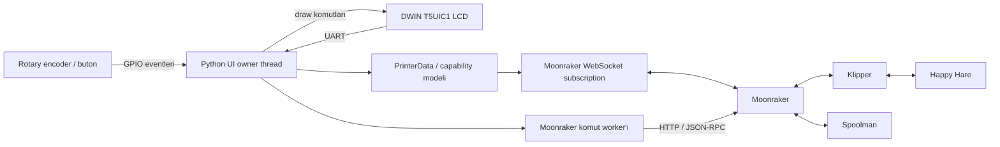

Rendering ve menü state'inin sahibi display thread'idir. GPIO callback'leri yalnızca immutable input eventlerini kuyruğa ekler. Yazıcı state'i birleştirilmiş ve immutable Moonraker subscription snapshot'ından gelir; komutlar ayrı seri worker üzerinden yürütüldüğü için UI rendering blocking HTTP isteklerine bağlı değildir.

## Desteklenen donanım

Mevcut UI, Ender 3 V2 düzeninde kullanılan DWIN T5UIC1 panel ailesini ve rotary encoder'ını hedefler.

Tipik bağlantı:

| Ekran | Raspberry Pi |
|---|---|
| RX | GPIO14 / UART TX |
| TX | GPIO15 / UART RX |
| Encoder A | Varsayılan GPIO21 |
| Encoder B | Varsayılan GPIO19 |
| Encoder Enter | Varsayılan GPIO20 |
| VCC | 5 V |
| GND | GND |

BCM numaralandırması kullanılır. Encoder/buton pinleri ve serial device ayarlanabildiği için bu varsayılanlar zorunlu değildir.

> [!IMPORTANT]
> Raspberry Pi UART yönlendirmesi Pi modeline ve işletim sistemi yapılandırmasına göre değişir. `/dev/ttyAMA0` veya `/dev/serial0` cihazının her zaman GPIO14/15'e bağlı olduğunu varsaymak yerine gerçek UART yönlendirmesini doğrulayın.

Mevcut kablolama fotoğrafları ve şemalar [images](images/) klasöründedir.

## Arayüz turu

Aşağıdaki her bölüm mevcut ekran davranışını açıklar. Temsili görsel daha sonra gerçek LCD fotoğrafı/görüntüsüyle değiştirilecektir.

### 1. Ana ekran

<p align="center">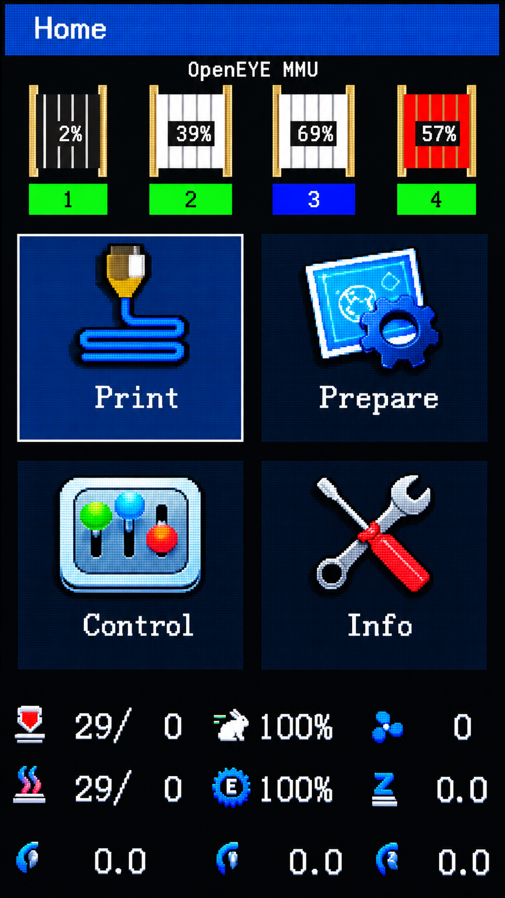</p>

Ana ekran temel navigasyon merkezidir. Print, Prepare, Control ve keşfedilen yazıcı capability'lerine göre Leveling veya Info girişlerini sunar.

Menü alanının altında kalan kompakt canlı dashboard; mevcutsa hotend/bed durumunu, baskı hız faktörünü, fanı, flow'u, runtime Z offset'i ve canlı X/Y/Z koordinatlarını gösterir.

Happy Hare algılanmadığında normal logo alanı gösterilir. MMU bulunduğunda bu alan aşağıda açıklanan canlı MMU paneline dönüşür.

### 2. Happy Hare MMU görselleştirmesi

Şu anda ayrı bir MMU kontrol ekranı yoktur. Mevcut Happy Hare entegrasyonu doğrudan yukarıdaki Ana ekranda gösterilir. Bildirilen gate sayısına göre uyarlanır ve sabit dört spool varsaymak yerine Happy Hare state'ini kullanır.

Her gate için şunları gösterebilir:

- kompakt yandan görünüşlü spool grafiği
- Happy Hare gate metadata'sından filament rengi
- gate'in Spoolman spool ID'sinden alınan kalan yüzde
- lane numarası
- Happy Hare exit LED zincirinden canlı lane gösterge rengi
- `mmu_machine` tarafından sunuluyorsa MMU unit display adı

LED hue değeri RGB565 dönüşümünden önce normalize edilir; böylece fiziksel LED özellikle düşük parlaklıkta sürülse bile rengi LCD'de görünür kalır. Tamamen kapalı LED siyah kalır. Lane numarası metni okunabilirlik için siyah/beyaz arasında otomatik geçiş yapar.

Mevcut uygulama canlı exit-LED renkleri için `unit0_mmu_exit_leds` nesnesine abonedir. Bu seçim şimdilik bilinçli olarak açık ve sabittir; ileride multi-unit/alternatif segment yapıları için genelleştirilebilir.

### 3. Baskı dosyası tarayıcısı

<p align="center">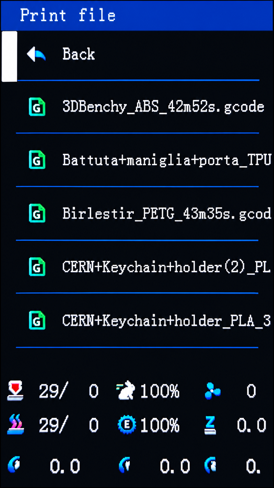</p>

Dosya tarayıcısı Moonraker dosya listesini kullanır ve encoder navigasyonunun akıcı kalması için sıralanmış, cache'lenmiş bir path snapshot'ı tutar.

Mümkün olduğunda seçim liste yenilemeleri sırasında korunur. Dosyaların silinmesi veya sırasının değişmesi cursor'u sessizce alakasız bir girdiye taşımaz. Baskı başlatma çift basmaya karşı korunur ve baskı ekranını açmadan önce hem komut kabulünü hem de subscription üzerinden gelen print-state doğrulamasını bekler.

### 4. Baskı ekranı

<p align="center">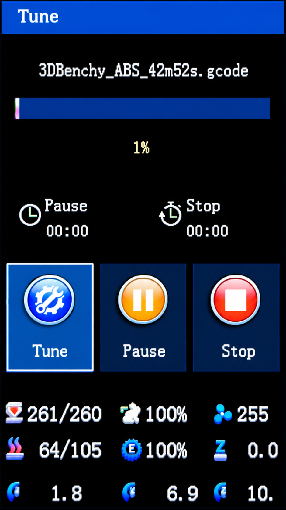</p>

Baskı ekranı şunları sunar:

- dosya adı
- progress bar ve yüzde
- geçen baskı süresi
- tahmini kalan süre
- Tune
- Pause / Resume
- Stop

Paused, tamamlandı, iptal edildi ve hata durumları ayrı ayrı ele alınır. Tamamlanma kararı Klipper'ın `print_stats.state` değerine göre verilir; yuvarlama nedeniyle %100 görünen değer çalışan baskıyı tek başına bitmiş saymaz.

### 5. Tune menüsü

<p align="center">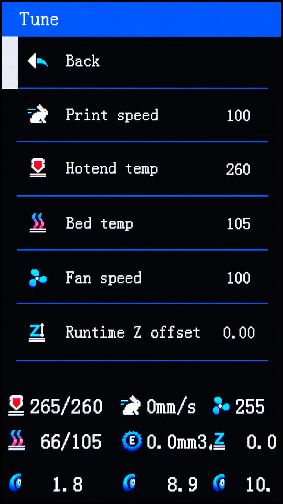</p>

Tune canlı baskı ayar menüsüdür. Satırlar yalnızca karşılık gelen yazıcı capability'si mevcutsa görünür. Makineye göre hotend hedefi, bed hedefi, fan, baskı hızı, runtime Z offset ve diğer aktif kontrolleri sunabilir.

Değerler Moonraker status ile senkron kalır. Açık bir editör kendi lokal hedefini korur; onaydan sonra tekrar subscription state'ine döner.

### 6. Prepare menüsü

<p align="center">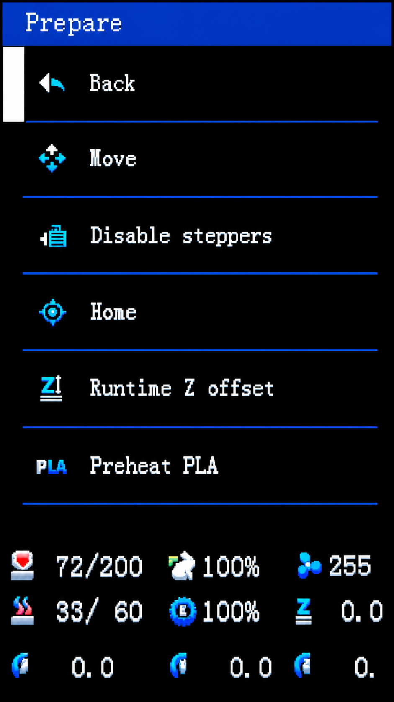</p>

Prepare; homing, hareket, cooldown/preheat ve runtime Z-offset erişimi gibi yazıcı hazırlık işlemlerini içerir. Girdiler, her yazıcının aynı heater, fan, probe veya leveling donanımına sahip olduğunu varsaymak yerine keşfedilen Klipper capability'lerinden oluşturulur.

### 7. Move / Live Jog

<p align="center">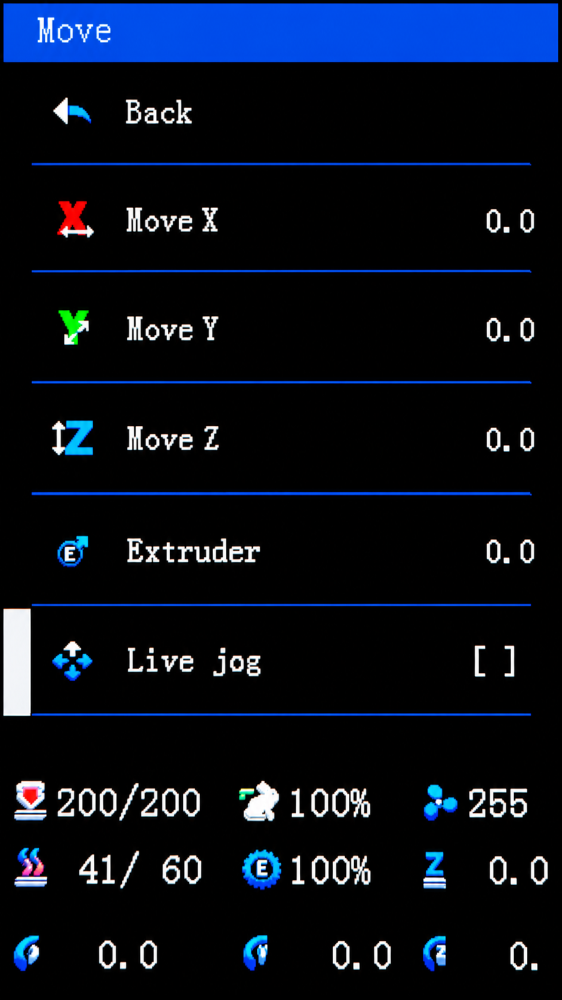</p>

Hareket ekranı canlı X/Y/Z konumlarını ve extruder mevcutsa E değerini gösterir.

Normal edit modu lokal hedefi değiştirir ve kontrollü bir hareket gönderir. Live Jog, daha hızlı konumlandırma için encoder hareketini anlık uygulayabilir. Jog komutları:

- seçilen eksenin home edilmiş olmasını gerektirir
- keşfedilen fiziksel travel limitlerine uyar
- baskı/paused durumunda hareketi reddeder
- ekstrüzyonu `can_extrude` ve yapılandırılmış extrusion distance ile doğrular
- relative hareket etrafında Klipper G-code state'ini save/restore eder
- state restore doğrulanamazsa daha fazla hareketi engeller

Konum kaynağı Klipper'ın command-space `gcode_move.position` değeridir; böylece UI runtime transform ve offsetlerle tutarlı kalır.

### 8. Control menüsü

<p align="center">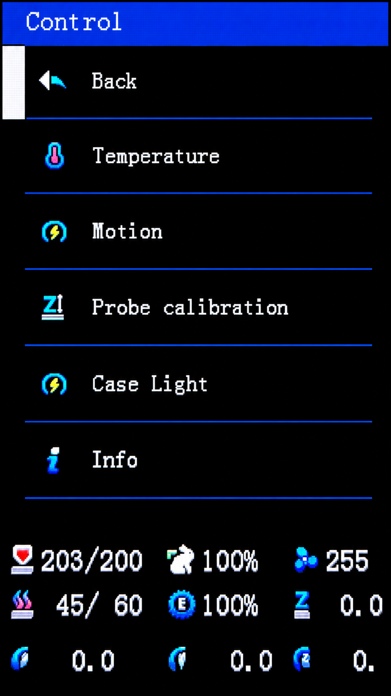</p>

Control daha çok yapılandırma odaklı menüdür. Mevcut satırlar capability tabanlıdır ve temperature presetleri, motion kontrolleri, probe calibration, case light ve bilgi sayfalarına yönlendirebilir.

### 9. Temperature / presetler

<p align="center">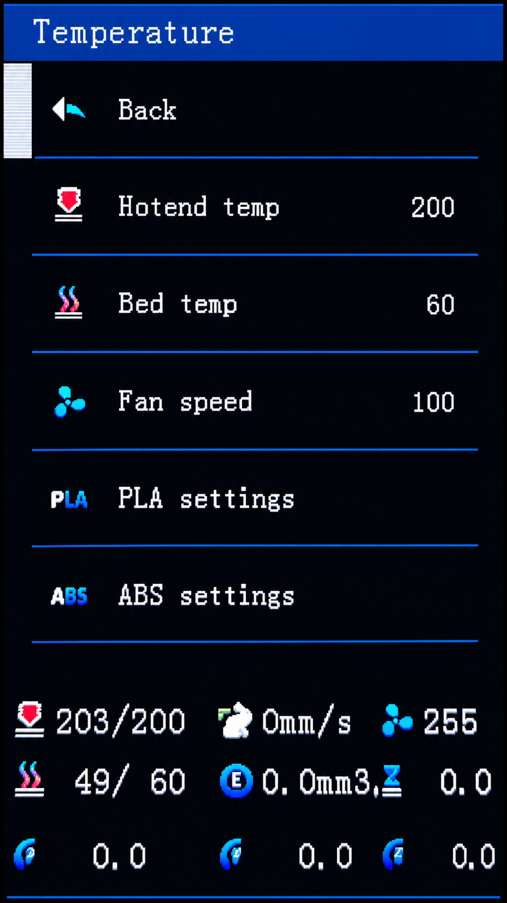</p>

Temperature kontrolleri kurulu cihazlardan üretilir: hotend, heated bed ve part fan birbirinden bağımsız olarak opsiyoneldir.

PLA ve ABS profilleri lokal olarak düzenlenebilir ve versioned JSON dosyasına kaydedilebilir. Profil uygulamadan önce kullanılabilir tüm hedefler doğrulanır, ardından kurulu cihazlar için tek script gönderilir. Preset kaydetmek yazıcıyı ısıtmaz.

Varsayılan saklama yeri:

```text
$XDG_CONFIG_HOME/dwin-lcd/presets.json
```

veya:

```text
~/.config/dwin-lcd/presets.json
```

Özel path `--settings-file` ile verilebilir.

### 10. Motion (runtime)

<p align="center">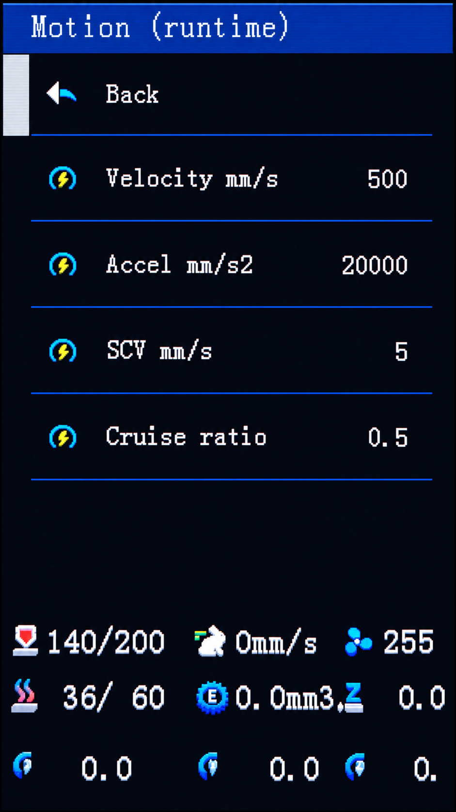</p>

Motion ekranı `SET_VELOCITY_LIMIT` üzerinden Klipper runtime velocity limitlerini düzenler:

- max velocity
- max acceleration
- square-corner velocity
- destekleniyorsa minimum cruise ratio

Desteklenmeyen alanlar gösterilmez. Bunlar runtime değişiklikleridir; ekran bunları otomatik olarak printer configuration içine kalıcı yazmaz.

### 11. Probe calibration sihirbazı

Gerekli probe/manual-probe object'leri mevcut olduğunda Control menüsünde yönlendirmeli probe calibration ekranı görünür.

Sihirbaz adımları bilinçli olarak ayırır:

- `PROBE_CALIBRATE` başlat
- 0.1 mm Raise / Lower
- 0.01 mm Raise / Lower
- Accept
- Abort
- yalnızca beklenen probe offset pending configuration change ise Save ve Klipper restart
- kaydetmeden çık

UI bir HTTP success yanıtının fiziksel/manual-probe state'inin zaten değiştiği anlamına geldiğini varsaymaz; subscription state doğrulamasını bekler.

### 12. Case Light

<p align="center">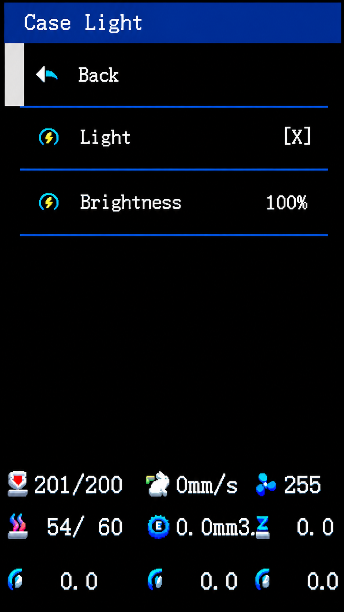</p>

`gcode_macro M355` capability'si algılanırsa Control menüsü case-light kontrolünü gösterebilir.

Sayfada:

- aç/kapat durumu
- %0–100 brightness editörü
- macro tarafından bildirilen state ile senkronizasyon

bulunur. Brightness içeride macro'nun 0–255 ölçeğine dönüştürülür.

### 13. Info

<p align="center">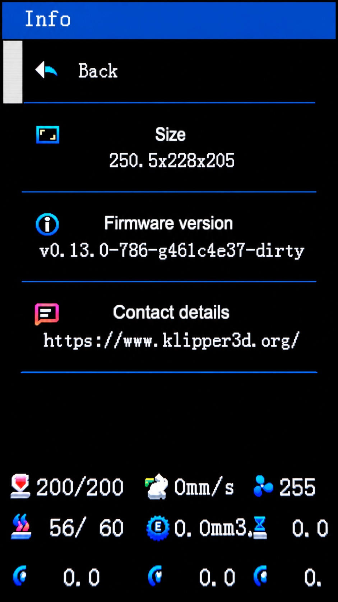</p>

Info ekranı algılanan machine/build bilgisini tanıdık DWIN düzeninde gösterir. Ana ekranın dördüncü slotunu özel one-step leveling girdisi kullanmıyorsa Info burada yer alır.

## Dinamik capability algılama

Menüler sabit bir yazıcı şablonundan oluşturulmaz. Uygulama startup/reconnect sırasında Moonraker/Klipper object'lerini keşfeder ve gerçek makineden capability çıkarır.

Örnekler:

- hotend var/yok
- heated bed var/yok
- part-cooling fan var/yok
- probe/manual-probe desteği
- bed-mesh/leveling desteği
- aktif Klipper sürümünün desteklediği motion alanları
- case-light macro varlığı
- Happy Hare MMU object'leri
- MMU unit metadata ve exit LED'leri

Böylece aynı UI kodu bağlı yazıcıda çalışamayacak kontrolleri göstermemeye çalışır.

## Moonraker bağlantı modeli

Varsayılan endpoint:

```text
http://127.0.0.1:7125
```

Uygulama şunları kullanır:

- komutlar ve bounded request/response işlemleri için HTTP
- printer object discovery ve canlı subscription için Moonraker WebSocket JSON-RPC
- eski connection'dan kalan queued komutların reconnect sonrası çalışmasını engelleyen connection epoch'ları
- otomatik WebSocket reconnect
- sessiz bağlantı kopmalarını algılayan ping/pong kontrolleri
- immutable birleştirilmiş printer-state snapshot'ları
- kör retry yerine command future'ları ve kalıcı hata acknowledgement

Opsiyonel API key authentication `MOONRAKER_API_KEY` üzerinden desteklenir. Boş key gönderilmez.

## Kurulum

### Gereksinimler

- UART + GPIO erişimi olan Raspberry Pi veya uyumlu Linux SBC
- Klipper ve Moonraker
- DWIN T5UIC1 uyumlu ekran/asset seti

### Otomatik kurulum

Master branch'i standart konuma klonlayıp installer'ı çalıştırın:

```bash
cd ~
git clone https://github.com/sezgynus/KlipperDWIN.git
cd ~/KlipperDWIN
./install.sh
```

Installer:

- gerekli sistem ve Python bağımlılıklarını kurar
- Python virtual environment'ını Git reposunun dışında `~/klipperdwin-env` altında oluşturur
- `KlipperDWIN.service` systemd servisini oluşturur ve etkinleştirir
- ilk kurulumda interaktif yapılandırmayı çalıştırır ve kullanıcı ayarlarını `~/.config/KlipperDWIN` altında tutar
- `KlipperDWIN` servisini Moonraker'ın allowed-services dosyasına ekler
- `moonraker.conf` yanına `KlipperDWIN.conf` oluşturur ve otomatik include eder
- Mainsail'in reponun `master` branch'indeki güncellemeleri kontrol edip kurabilmesi için `[update_manager KlipperDWIN]` kaydını oluşturur
- `requirements.txt` değiştiğinde Python bağımlılıklarını Moonraker'ın güncellemesini sağlar

Moonraker'ın `dev` update channel'ı yapılandırılmış primary branch'teki en yeni commit'i takip eder. Runtime ayarları ve virtualenv repo dışında tutulduğu için Moonraker Git reposunu temiz durumda yönetebilir.

Moonraker standart dışı bir configuration path kullanıyorsa:

```bash
MOONRAKER_CONFIG=/path/to/moonraker.conf ./install.sh
```

İlk kurulumda donanıma bağlı ayarlar interaktif olarak sorulur. Varsayılanları kabul etmek için Enter'a basabilirsiniz:

```text
Moonraker URL [http://127.0.0.1:7125]:
Serial port [/dev/ttyS0]:
Encoder A GPIO (BCM) [21]:
Encoder B GPIO (BCM) [19]:
Encoder button GPIO (BCM) [20]:
Moonraker power device [Printer]:
Power-on button hold time (ms, 0 = immediate) [2000]:
```

Bu ayarları daha sonra değiştirmek için:

```bash
cd ~/KlipperDWIN
./configure.sh
```

`install.sh` tekrar çalıştırıldığında mevcut kullanıcı ayarları korunur. `configure.sh` mevcut değerleri varsayılan olarak gösterir, `~/.config/KlipperDWIN/KlipperDWIN.env` dosyasını günceller ve kayıttan sonra servisi yeniden başlatabilir.

İnteraktif yapılandırma; Moonraker endpoint'ini, LCD UART'ını, encoder GPIO pinlerini, encoder buton GPIO'sunu, Moonraker power-device adını ve power-on basılı tutma süresini kapsar. `DWIN_POWER_ON_HOLD_MS` milisaniye cinsindendir; varsayılan değer `2000`'dir. `0` seçilirse encoder butonuna basıldığı anda yazıcıyı açma isteği gönderilir.

### Moonraker / Mainsail ile güncelleme

Installer KlipperDWIN'i Moonraker Update Manager'a otomatik olarak kaydeder. Moonraker oluşturulan `KlipperDWIN.conf` dosyasını yükledikten sonra KlipperDWIN, Mainsail'de **Machine → Update Manager** altında diğer yönetilen bileşenlerle birlikte görünür.

Yeni sürümü kontrol etmek için **Refresh**, kurmak için KlipperDWIN satırındaki **Update** kullanılabilir. Moonraker Git checkout'u günceller, gerektiğinde Python requirements'larını yeniler ve yönetilen `KlipperDWIN` servisini yeniden başlatır. Kullanıcı yapılandırması repo dışında `~/.config/KlipperDWIN` altında tutulduğu için normal Update Manager güncellemeleri bu ayarların üzerine yazmaz.

Updater reponun `master` branch'ini takip eder. Version tag'leri Moonraker/Mainsail'de görünen okunabilir sürümün tabanını oluşturur; tag sonrasındaki commit'ler örneğin `v0.2.1-1-gabcdef12` biçiminde gösterilebilir.

> [!NOTE]
> Yapılandırma değişiklikleri için `./configure.sh` kullanın. Yerel donanım ayarları için repo tarafından takip edilen dosyaları değiştirmeyin; Moonraker yönetilen Git checkout'un temiz kalmasını bekler.

## UART hazırlığı

Serial login console'u kapatıp serial hardware'i etkinleştirmek için `raspi-config` kullanın, ardından yeniden başlatın.

```bash
sudo raspi-config
```

Pi modelinizde fiziksel pinlere atanmış gerçek UART'ı doğrulayın. Bluetooth overlay'leri ve boot configuration path'leri Raspberry Pi nesilleri ve işletim sistemi sürümleri arasında değiştiğinden proje tek bir evrensel overlay dayatmaz.

## Manuel çalıştırma

Repo varsayılanlarıyla örnek:

```bash
cd ~/KlipperDWIN

~/klipperdwin-env/bin/python run.py \
  --serial-port /dev/ttyS0 \
  --encoder-pins 21 19 \
  --button-pin 20 \
  --moonraker-url http://127.0.0.1:7125
```

Kendi kurulumunuzdaki gerçek UART ve GPIO pinlerini kullanın.

Mevcut ayarlar:

| Environment | CLI | Varsayılan |
|---|---|---|
| `MOONRAKER_URL` | `--moonraker-url` | `http://127.0.0.1:7125` |
| `MOONRAKER_API_KEY` | yalnız environment | boş |
| `DWIN_REQUEST_TIMEOUT` | `--request-timeout` | 5 sn |
| `DWIN_SERIAL_PORT` | `--serial-port` | `/dev/ttyS0` |
| `DWIN_ENCODER_PINS` | `--encoder-pins A B` | `21 19` |
| `DWIN_BUTTON_PIN` | `--button-pin` | `20` |
| `DWIN_SETTINGS_FILE` | `--settings-file` | installer yapılandırmasından sonra `~/.config/KlipperDWIN/presets.json` |
| `DWIN_POWER_DEVICE` | `--power-device` | `Printer` |
| `DWIN_POWER_ON_HOLD_MS` | `--power-on-hold-ms` | `2000` ms |

## systemd ile açılışta çalıştırma

Örnek unit ve environment dosyası repo içinde bulunur.

```bash
id -u dwinlcd >/dev/null 2>&1 || \
  sudo useradd --system --user-group \
  --home-dir /var/lib/dwin-lcd --no-create-home \
  --shell /usr/sbin/nologin dwinlcd

sudo install -m 0600 ~/KlipperDWIN/dwin-lcd.env.example /etc/default/dwin-lcd
sudoedit /etc/default/dwin-lcd

sudo install -m 0644 ~/KlipperDWIN/simpleLCD.service \
  /etc/systemd/system/simpleLCD.service

sudo systemctl daemon-reload
sudo systemctl enable --now simpleLCD.service
sudo journalctl -u simpleLCD.service -f
```

Servis ayrı bir kullanıcı kullanır, hata durumunda yeniden başlar, presetleri `/var/lib/dwin-lcd` altında saklar ve journald'a log yazar. Servis kullanıcısının işletim sisteminizde gerçek UART ve gpiochip cihazlarına erişebildiğini doğrulayın.

## Happy Hare entegrasyonu

Gerekli Klipper object'leri mevcut olduğunda Happy Hare desteği otomatik devreye girer.

UI şu verileri kullanır:

- `mmu` — gate sayısı, seçili gate, gate status, gate renkleri, spool ID'leri ve filament state
- `mmu_machine` — unit ad/display metadata
- `unit0_mmu_exit_leds` — gate başına canlı exit LED renkleri

Ana ekrandaki görselleştirmeyi almak için ayrı bir MMU ekranı gerekmez; state mevcut olduğunda panel görünür.

## Spoolman entegrasyonu

Happy Hare her gate için `gate_spool_id` sağlar. Uygulama Moonraker Spoolman proxy üzerinden ilgili spool'u alır ve weight verisinden kalan yüzdeyi hesaplar.

Böylece yüzdeler tek bir global aktif Spoolman spool'una bağlı kalmak yerine gate bazlı olur.

Spoolman verisi yoksa MMU panelinin geri kalanı çalışmaya devam eder.

## Case-light macro sözleşmesi

Case-light desteği opsiyoneldir ve `gcode_macro M355` varsa görünür.

UI şunları gönderir:

```text
M355 S0/1
M355 P0..255
```

State senkronizasyonu için query yanıtında şuna eşdeğer bir çıktı bekler:

```text
Light is ON, Brightness=128
```

Çift yönlü case-light status istiyorsanız macro'nuzu bu sözleşmeye uygun hale getirin.

## Encoder ile yazıcıyı açma

Moonraker'da bir power device tanımlıysa encoder butonu, Klipper veya LCD UART offline durumdayken bile yazıcıyı açabilir. Cihaz adı varsayılan olarak `Printer`'dır ve `DWIN_POWER_DEVICE` ile değiştirilebilir. Basılı tutma süresi `DWIN_POWER_ON_HOLD_MS` ile belirlenir: varsayılan `2000` değeri 2 saniye basılı tutmayı gerektirir; `0` ise butona basıldığı anda power-on isteği gönderir.

## Güvenilirlik ve güvenlik davranışı

Proje yazıcıyı değiştiren işlemlerde bilinçli olarak optimistic UI state kullanmaz.

- Komutlar ayrı worker üzerinde seri yürütülür.
- Başarısız komutlar otomatik tekrar gönderilmez.
- Connection değişimi eski epoch'tan kalan queued komutları geçersiz kılar.
- Offline/eski input eventleri atılır.
- Hareket; homing, bounds ve printer state ile doğrulanır.
- Jogging G-code state'ini korur/restore eder.
- Doğrulanamayan jog-state restore ek hareketleri engeller.
- Print start hem command result hem subscribed print state bekler.
- Pause/resume/cancel karşılık gelen subscribed state'i bekler.
- Probe calibration manual-probe state değişimlerini bekler.
- UART short-write/hatalarda fail-closed davranır.
- Panel reconnect state'i yeniden çizer fakat printer komutlarını tekrar oynatmaz.

Timeout durumunda komut yazıcıya ulaşmış ancak cevabı kaybolmuş olabilir. Belirsiz bir işlemi tekrarlamadan önce gerçek yazıcı state'ini kontrol edin.

## UART/display katmanı

DWIN transport katmanı bounded startup handshake, incremental ACK parsing, full-frame writes ve reconnect denemeleri uygular.

Rendering tarafında:

- stock ASCII fontlar için text sanitization/transliteration
- bounded string payloadları
- signed/fractional numeric formatting
- değerleri sessizce kesmek yerine overflow markerları
- icon/frame copy helper'ları
- RGB565 renkleri
- backlight kontrolü
- gereksiz UART trafiğini azaltan update coalescing

bulunur.

Düşük seviye ayrıntılar için [LCD asset notları](docs/lcd-assets.md) ve [source audit](docs/source-audit.md) belgelerine bakın.

## Testler

Tüm izole test suite'i:

```bash
cd ~/KlipperDWIN
~/klipperdwin-env/bin/python -m unittest discover -s tests -v
```

Testler Moonraker client/subscription katmanını, printer-state normalization'ı, capability detection'ı, menü davranışlarını, input routing'i, command handling'i, movement safety'yi, UART framing/render helper'larını, MMU verisini ve diğer regression alanlarını kapsar.

Unit testler fiziksel yazıcı doğrulamasının yerine geçmez.

## Mevcut kapsam / bilinen sınırlar

- Display UI mevcut 272×480 DWIN asset/layout ailesi etrafında tasarlanmıştır.
- Canlı Happy Hare lane renkleri şu anda açıkça `unit0_mmu_exit_leds` adlı object'i kullanır.
- Multi-unit MMU LED-source seçimi henüz genelleştirilmemiştir.
- Case-light desteği uyumlu bir `M355` macro'ya bağlıdır.
- Runtime Motion değerleri otomatik olarak printer configuration'a kalıcı yazılmaz.
- Test edilen DWIN/encoder bağlantısı dışındaki donanım uyumluluğu motion kontrollerine güvenmeden önce doğrulanmalıdır.

## Proje geçmişi ve katkılar

Bu repo açık kaynak kökenini ve Git geçmişini korur.

Projenin kökeni şu DWIN T5UIC1 LCD çalışmalarına dayanır:

- [odwdinc/DWIN_T5UIC1_LCD](https://github.com/odwdinc/DWIN_T5UIC1_LCD)
- [bustedlogic/DWIN_T5UIC1_LCD](https://github.com/bustedlogic/DWIN_T5UIC1_LCD)

Mevcut proje daha sonra Klipper/Moonraker merkezli yeni state/command mimarisi, dinamik capability sistemi, daha güvenli input handling, genişletilmiş kontroller, MMU/Spoolman desteği ve regression test altyapısıyla kapsamlı biçimde yeniden işlendi.

Bağımsızlaşmak attribution'ı ortadan kaldırmaz: orijinal copyright bildirimleri, commit geçmişi ve GPL yükümlülükleri geçerliliğini korur.

Bu yazılımın kullandığı veya entegre olduğu diğer projeler:

- [Klipper](https://github.com/Klipper3d/klipper)
- [Moonraker](https://github.com/Arksine/moonraker)
- [Happy Hare](https://github.com/moggieuk/Happy-Hare)
- [Spoolman](https://github.com/Donkie/Spoolman)

## Katkıda bulunma

Issue ve pull request'ler açıktır. UI değişikliklerinde ilgili printer capability/setup bilgisini ekleyin ve mümkün olduğunda aynı değişiklik içinde regression test ekleyin/güncelleyin.

Donanım/UI bug raporlarında şu bilgiler faydalıdır:

- Raspberry Pi modeli ve OS
- UART device
- encoder/buton BCM pinleri
- Klipper + Moonraker sürümleri
- ilgili opsiyonel component (probe, MMU, Spoolman, M355 vb.)
- log bölümü
- görsel problem varsa panel fotoğrafı

## Lisans

GNU General Public License v3.0. Bkz. [LICENSE](LICENSE).

---

<p align="center">
  <strong>Yazıcıda Klipper. Ağda Moonraker. Kontrol parmaklarınızın ucunda DWIN.</strong>
</p>
