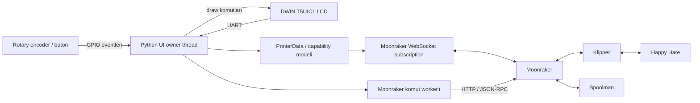

# DWIN T5UIC1 LCD — Klipper / Moonraker Arayüzü

<p align="center">
  <strong>DWIN T5UIC1 tabanlı 3D yazıcı ekranları için Klipper ve Moonraker merkezli bağımsız Python arayüzü.</strong>
</p>

<p align="center">
  <a href="README.md"></a>
  <a href="README_TR.md"></a>
</p>

<p align="center">
  <a href="https://github.com/sezgynus/KlipperDWIN/tree/v0.7.0"></a>
  
  
  
  
  
  
  
</p>

## Bu proje nedir?

Bu proje, Ender 3 V2 gibi yazıcılarda kullanılan yaygın 4.3 inç DWIN T5UIC1 rotary-encoder ekranını yerel bir Klipper kontrol paneline dönüştürür.

Uygulama Raspberry Pi üzerinde çalışır; ekranla UART üzerinden, encoder ile GPIO üzerinden, yazıcıyla ise Moonraker HTTP/WebSocket API'leri üzerinden haberleşir. OctoPrint uyumluluk katmanına veya doğrudan Klipper Unix socket entegrasyonuna ihtiyaç duymaz.

Proje artık küçük bir uyumluluk yamasının ötesine geçti: mevcut kod tabanı özel Moonraker istemci/subscription katmanı, capability tabanlı menüler, komut/sonuç takibi, güvenli input yönlendirme, runtime motion kontrolleri, live jog, probe kalibrasyonu, Mainsail ile senkronize sıcaklık presetleri, Happy Hare MMU görselleştirmesi, Spoolman kalan filament verisi, case-light kontrolü, UART recovery ve regression test altyapısı içerir.

## Öne çıkan özellikler

- Doğrudan Moonraker HTTP + WebSocket entegrasyonu
- Mevcut Klipper object ve capability'lerinin otomatik keşfi
- Enkoderle gezilen, sayfa başına dört ikonlu ana menü
- Sıcaklık, fan, hız, flow, Z offset ve XYZ için canlı ana ekran dashboard'u
- Dosya tarayıcı ve doğrulamalı baskı başlatma akışı
- İlerleme, geçen/kalan süre, pause/resume, stop ve tune içeren baskı ekranı
- Makine limitlerini doğrulayan X/Y/Z/E hareket kontrolü
- Opsiyonel Live Jog modu
- Max velocity, max acceleration, square-corner velocity ve minimum cruise ratio için runtime motion ayarı
- Runtime Z-offset kontrolü
- Klipper yön ve dönüş miktarlarını gösteren dört köşe vida ayarı
- Bed mesh kalibrasyonu, renkli yükseklik haritası ve kayıtlı profil görüntüleme
- Açık TESTZ adımları ve kontrollü SAVE_CONFIG akışına sahip probe kalibrasyon sihirbazı
- Otomatik Mainsail temperature-preset keşfi, LCD üzerinden düzenleme ve Mainsail'e geri kaydetme
- M355 macro üzerinden opsiyonel case-light arayüzü
- Ana ekranda Happy Hare MMU görselleştirmesi
- Gate başına filament rengi ve MMU unit adı
- Happy Hare exit LED renklerinden canlı lane göstergeleri
- MMU gate başına Spoolman kalan filament yüzdesi
- LED renklerinde okunabilirlik için otomatik siyah/beyaz lane numarası kontrastı
- Dayanıklı UART handshake ve reconnect davranışı
- Ayrı komut worker'ı ve connection-epoch koruması
- Event queue tabanlı input yönlendirme ile encoder acceleration
- Installer tarafından yapılandırılan `KlipperDWIN.service` servisi
- Python unit/regression testleri

## Proje durumu

- ✅ **Moonraker entegrasyonu** — doğrudan HTTP + WebSocket haberleşmesi.
- ✅ **Capability tabanlı UI** — dinamik menüler ve canlı yazıcı dashboard'u.
- ✅ **Baskı akışı** — dosya tarayıcısı, print-state takibi ve baskı kontrolleri.
- ✅ **Yazıcı kontrolleri** — Tune, Prepare, Move / Live Jog ve runtime Motion kontrolleri.
- ✅ **Temperature & presetler** — dinamik olarak keşfedilen, LCD üzerinden düzenlenip kaydedilebilen Mainsail presetleriyle temperature kontrolleri.
- ✅ **Case Light** — uyumlu bir `M355` macro üzerinden kontrol.
- ✅ **Happy Hare görselleştirmesi** — Home ekranında MMU gate renkleri ve exit-LED state'i.
- ✅ **Spoolman entegrasyonu** — MMU gate başına kalan filament yüzdesi.
- ✅ **Encoder ile power-on** — Moonraker power device üzerinden yazıcıyı açma.
- ✅ **Kurulum & güncelleme** — interaktif yapılandırma, systemd servisi ve Moonraker Update Manager entegrasyonu.
- ✅ **Güvenilirlik** — UART recovery, kontrollü komut yürütme ve regression testleri.
- ✅ **Probe Calibration** — doğru `PROBE_CALIBRATE` / `TESTZ` akışı, manual-probe state takibi, Z ayarı, `ACCEPT`, `ABORT` ve kontrollü `SAVE_CONFIG` yönetimi.
- ✅ **Screws Tilt Adjust** — `screws_tilt_adjust` desteği, `SCREWS_TILT_CALCULATE`, vida konumlarının grafiksel gösterimi ve hesaplanan CW/CCW düzeltme yönlendirmesi.
- ✅ **Bed Mesh Visualization & Control** — `BED_MESH_CALIBRATE`, renkli Z ızgarası, kontrollü profil kaydı ve kayıtlı profilleri aktif mesh'i değiştirmeden görüntüleme.
- 🛠️ **Happy Hare MMU Control** — Home → MMU menüsü şimdilik yalnızca Back içerir; kontrol işlemleri planlanmaktadır.
- 🛠️ **Happy Hare Multi-Unit Support** — mevcut sabit `unit0_mmu_exit_leds` kaynağı yerine dinamik MMU unit ve LED-source keşfi.
- 🛠️ **Hardware Validation** — fiziksel testlerin ek DWIN T5UIC1 ve Klipper konfigürasyonlarında genişletilmesi.

## Kurulum

### Gereksinimler

- UART + GPIO erişimi olan Raspberry Pi veya uyumlu Linux SBC
- Klipper ve Moonraker
- DWIN T5UIC1 uyumlu ekran/asset seti

### Otomatik kurulum

Master branch'i standart konuma klonlayıp installer'ı çalıştırın:

```bash
cd ~
git clone https://github.com/sezgynus/KlipperDWIN.git
cd ~/KlipperDWIN
./install.sh
```

Installer:

- gerekli sistem ve Python bağımlılıklarını kurar
- Python virtual environment'ını Git reposunun dışında `~/klipperdwin-env` altında oluşturur
- `KlipperDWIN.service` systemd servisini oluşturur ve etkinleştirir
- ilk kurulumda interaktif yapılandırmayı çalıştırır ve kullanıcı ayarlarını `~/.config/KlipperDWIN` altında tutar
- `KlipperDWIN` servisini Moonraker'ın allowed-services dosyasına ekler
- `moonraker.conf` yanına `KlipperDWIN.conf` oluşturur ve otomatik include eder
- Mainsail'in reponun `master` branch'indeki güncellemeleri kontrol edip kurabilmesi için `[update_manager KlipperDWIN]` kaydını oluşturur
- `requirements.txt` değiştiğinde Python bağımlılıklarını Moonraker'ın güncellemesini sağlar

Moonraker'ın `dev` update channel'ı yapılandırılmış primary branch'teki en yeni commit'i takip eder. Runtime ayarları ve virtualenv repo dışında tutulduğu için Moonraker Git reposunu temiz durumda yönetebilir.

Moonraker standart dışı bir configuration path kullanıyorsa:

```bash
MOONRAKER_CONFIG=/path/to/moonraker.conf ./install.sh
```

İlk kurulumda donanıma bağlı ayarlar interaktif olarak sorulur. Varsayılanları kabul etmek için Enter'a basabilirsiniz:

```text
Moonraker URL [http://127.0.0.1:7125]:
Serial port [/dev/ttyS0]:
Encoder A GPIO (BCM) [21]:
Encoder B GPIO (BCM) [19]:
Encoder button GPIO (BCM) [20]:
Moonraker power device [Printer]:
Power-on button hold time (ms, 0 = immediate) [2000]:
```

Bu ayarları daha sonra değiştirmek için:

```bash
cd ~/KlipperDWIN
./configure.sh
```

`install.sh` tekrar çalıştırıldığında mevcut kullanıcı ayarları korunur. `configure.sh` mevcut değerleri varsayılan olarak gösterir, `~/.config/KlipperDWIN/KlipperDWIN.env` dosyasını günceller ve kayıttan sonra servisi yeniden başlatabilir.

İnteraktif yapılandırma; Moonraker endpoint'ini, LCD UART'ını, encoder GPIO pinlerini, encoder buton GPIO'sunu, Moonraker power-device adını ve power-on basılı tutma süresini kapsar. `DWIN_POWER_ON_HOLD_MS` milisaniye cinsindendir; varsayılan değer `2000`'dir. `0` seçilirse encoder butonuna basıldığı anda yazıcıyı açma isteği gönderilir.

### Moonraker / Mainsail ile güncelleme

Installer KlipperDWIN'i Moonraker Update Manager'a otomatik olarak kaydeder. Moonraker oluşturulan `KlipperDWIN.conf` dosyasını yükledikten sonra KlipperDWIN, Mainsail'de **Machine → Update Manager** altında diğer yönetilen bileşenlerle birlikte görünür.

Yeni sürümü kontrol etmek için **Refresh**, kurmak için KlipperDWIN satırındaki **Update** kullanılabilir. Moonraker Git checkout'u günceller, gerektiğinde Python requirements'larını yeniler ve yönetilen `KlipperDWIN` servisini yeniden başlatır. Kullanıcı yapılandırması repo dışında `~/.config/KlipperDWIN` altında tutulduğu için normal Update Manager güncellemeleri bu ayarların üzerine yazmaz.

Updater reponun `master` branch'ini takip eder. Version tag'leri Moonraker/Mainsail'de görünen okunabilir sürümün tabanını oluşturur; tag sonrasındaki commit'ler örneğin `v0.2.1-1-gabcdef12` biçiminde gösterilebilir.

> [!NOTE]
> Yapılandırma değişiklikleri için `./configure.sh` kullanın. Yerel donanım ayarları için repo tarafından takip edilen dosyaları değiştirmeyin; Moonraker yönetilen Git checkout'un temiz kalmasını bekler.

## Desteklenen donanım

Mevcut UI, Ender 3 V2 düzeninde kullanılan DWIN T5UIC1 panel ailesini ve rotary encoder'ını hedefler.

Tipik bağlantı:

| Ekran | Raspberry Pi |
|---|---|
| RX | GPIO14 / UART TX |
| TX | GPIO15 / UART RX |
| Encoder A | Varsayılan GPIO21 |
| Encoder B | Varsayılan GPIO19 |
| Encoder Enter | Varsayılan GPIO20 |
| VCC | 5 V |
| GND | GND |

BCM numaralandırması kullanılır. Encoder/buton pinleri ve serial device ayarlanabildiği için bu varsayılanlar zorunlu değildir.

> [!IMPORTANT]
> Raspberry Pi UART yönlendirmesi Pi modeline ve işletim sistemi yapılandırmasına göre değişir. `/dev/ttyAMA0` veya `/dev/serial0` cihazının her zaman GPIO14/15'e bağlı olduğunu varsaymak yerine gerçek UART yönlendirmesini doğrulayın.

Mevcut kablolama fotoğrafları ve şemalar [images](images/) klasöründedir.

## Arayüz turu

Aşağıdaki ekran görüntüleri arayüzü örnekler; açıklamalar güncel menü düzenini ve davranışını belirtir.

### 1. Ana ekran

<p align="center"></p>

Ana ekran sayfa başına dört ikon sunar. Bed mesh desteği varsa ilk sayfada Print, Prepare, Control ve Leveling; ikinci sayfada MMU ve Info bulunur. Bed mesh desteği yoksa MMU ilk sayfanın dördüncü ikonudur ve Info ikinci sayfadadır. MMU her zaman Info'dan önce gelir. Enkoderi çevirmek sayfalar arasında ilerler veya geri döner; boş alanlar seçilemez. Logo/MMU paneli ve canlı durum alanı sabit kalır. MMU ve Info'dan dönüş aynı Home seçimini korur.

Menü alanının altında kalan kompakt canlı dashboard; mevcutsa hotend/bed durumunu, baskı hız faktörünü, fanı, flow'u, runtime Z offset'i ve canlı X/Y/Z koordinatlarını gösterir.

Happy Hare algılanmadığında normal logo alanı gösterilir. MMU bulunduğunda bu alan aşağıda açıklanan canlı MMU paneline dönüşür.

### 2. MMU menüsü / Happy Hare görselleştirmesi

**Home → MMU**, Happy Hare bağlı olmasa da görünür ve üç filament makaralı ikonla gösterilir. Şimdilik yalnızca **Back** içeren boş bir menü açar; giriş ve çıkış yazıcıya komut göndermez. MMU kontrol işlemleri henüz uygulanmamıştır. Happy Hare canlı paneli Ana ekranda kalır; bildirilen gate sayısına uyarlanır ve Happy Hare state verisini kullanır.

Her gate için şunları gösterebilir:

- kompakt yandan görünüşlü spool grafiği
- Happy Hare gate metadata'sından filament rengi
- gate'in Spoolman spool ID'sinden alınan kalan yüzde
- lane numarası
- Happy Hare exit LED zincirinden canlı lane gösterge rengi
- `mmu_machine` tarafından sunuluyorsa MMU unit display adı

LED hue değeri RGB565 dönüşümünden önce normalize edilir; böylece fiziksel LED özellikle düşük parlaklıkta sürülse bile rengi LCD'de görünür kalır. Tamamen kapalı LED siyah kalır. Lane numarası metni okunabilirlik için siyah/beyaz arasında otomatik geçiş yapar.

Mevcut uygulama canlı exit-LED renkleri için `unit0_mmu_exit_leds` nesnesine abonedir. Bu seçim şimdilik bilinçli olarak açık ve sabittir; ileride multi-unit/alternatif segment yapıları için genelleştirilebilir.

### 3. Baskı dosyası tarayıcısı

<p align="center"></p>

Dosya tarayıcısı Moonraker dosya listesini kullanır ve encoder navigasyonunun akıcı kalması için önbellekte bir yol listesi tutar. Mainsail'in Moonraker veritabanına kaydettiği `view.gcodefiles.sortBy` ve `view.gcodefiles.sortDesc` tercihlerini beş saniyede bir okur. Dosya adı (büyük/küçük harf duyarsız), son değiştirilme tarihi ve dosya boyutu her iki yönde desteklenir. Eksik, geçersiz veya erişilemeyen ayarlarda ve desteklenmeyen metadata sıralama alanlarında son değiştirilme tarihi kullanılır; en yeni dosya üsttedir. Tarayıcı yalnızca mevcut klasörü gösterir; alt klasörler klasör ikonuyla üstte yer alır ve boş klasörler de listelenir. Klasör seçimi içine girer. Aynı sıralama kriteri ve yönü her seviyede klasörlere ve dosyalara uygulanır. **Back**, üst klasöre dönüp seçimi korur; kökte Ana ekrana döner. Satırlarda yalnızca ad gösterilir, baskı tam göreli dosya yoluyla başlatılır. Klasör içeriği dosya listesi revision veya bağlantı değişimine kadar önbellekte tutulur. Ayarlar yalnızca okunur; LCD Mainsail tercihlerini değiştirmez.

Dosya seçimi, baskıdan önce thumbnail onay ekranını açar. Resim Moonraker’dan indirilir ve siyah arka planda oranı korunarak baseline 128×128 JPEG’e dönüştürülür. JPEG, UART üzerinden 128 baytlık paketlerle LCD’nin geçici SRAM belleğine parça parça aktarılır ve doğrudan bellekten gösterilir. LCD flash belleği ve kayıtlı arayüz görsellerinin üzerine yazılmaz. Başlangıçta **Cancel** seçilidir ve aynı klasör/dosya seçimine döner; **Print** dosyayı yeniden kontrol edip mevcut doğrulamalı baskı akışını başlatır. Thumbnail eksikse veya alınamazsa dosya adı ve butonlar kullanılabilir kalır. İndirme, dönüştürme, JPEG bayt sayısı ve UART aktarım süresi loglanır. Bu ilk önizleme sürümünde baskı metadata bilgileri henüz gösterilmez. Manuel güncellemede servisi yeniden başlatmadan önce güncel `requirements.txt` dosyasını `~/klipperdwin-env` içine kurun; Pillow bağımlılığı eklendi.

Mümkün olduğunda seçim liste yenilemeleri sırasında korunur. Dosyaların silinmesi veya sırasının değişmesi cursor'u sessizce alakasız bir girdiye taşımaz. Baskı başlatma çift basmaya karşı korunur ve baskı ekranını açmadan önce hem komut kabulünü hem de subscription üzerinden gelen print-state doğrulamasını bekler.

Dosya gezgini, mevcut klasörün sıralamasındaki ilk beş dosyanın thumbnail görselini ilk dosyadan başlayarak LCD’nin 32 KB SRAM belleğine önceden yükler. Önbellekteki dosya seçildiğinde yalnızca gösterme komutu gönderilir. Klasör, dosya listesi ve Mainsail sıralama değişiklikleri yükleme önceliklerini güncellerken değişmemiş görseller korunur. Değiştirilen/silinen dosyalar yol, değiştirilme zamanı ve boyutla geçersiz sayılır; UART veya backend bağlantısının yenilenmesi önbelleği temizler. Açılan diğer dosyalar kalan alanda tutulur; yer gerektiğinde ilk beşin dışındaki en uzun süredir kullanılmayan görsel önce çıkarılır. İlk beş görsel sığmazsa sıralamada önce gelenler önceliklidir; başka bir dosya seçildiğinde gerektiği kadar yer açılır. Arka plan aktarımı küçük paket gruplarıyla ilerler ve seçilen dosya öncelik kazanır. Eksik veya geçici olarak alınamayan thumbnail görselleri kısa bir beklemeden sonra yeniden denenir. Loglar SRAM önbellek isabetini ve önizlemenin açılmasından gösterme komutuna kadar geçen süreyi bildirir.

### 4. Baskı ekranı

<p align="center"></p>

Baskı ekranı şunları sunar:

- dosya adı
- progress bar ve yüzde
- geçen baskı süresi
- tahmini kalan süre
- Tune
- Pause / Resume
- Stop

Paused, tamamlandı, iptal edildi ve hata durumları ayrı ayrı ele alınır. Tamamlanma kararı Klipper'ın `print_stats.state` değerine göre verilir; yuvarlama nedeniyle %100 görünen değer çalışan baskıyı tek başına bitmiş saymaz.

### 5. Tune menüsü

<p align="center"></p>

Tune canlı baskı ayar menüsüdür. Satırlar yalnızca karşılık gelen yazıcı capability'si mevcutsa görünür. Makineye göre hotend hedefi, bed hedefi, fan, baskı hızı, runtime Z offset ve diğer aktif kontrolleri sunabilir.

Değerler Moonraker status ile senkron kalır. Açık bir editör kendi lokal hedefini korur; onaydan sonra tekrar subscription state'ine döner.

### 6. Prepare menüsü

<p align="center"></p>

Prepare; homing, hareket, cooldown/preheat ve runtime Z-offset erişimi gibi yazıcı hazırlık işlemlerini içerir. Girdiler, her yazıcının aynı heater, fan, probe veya leveling donanımına sahip olduğunu varsaymak yerine keşfedilen Klipper capability'lerinden oluşturulur.

#### Screws Tilt Adjust

<p align="center"></p>

Başarı mesajları yeşil, ayar gereken durumdaki talimatlar nötr beyazdır.

`[screws_tilt_adjust]` tanımlıysa **Prepare → Screws Tilt Adjust → Calculate**, Klipper'ın `SCREWS_TILT_CALCULATE` komutunu başlatır. Bu ekran dört ayrı köşe vidası ve yapılandırılmış probe ile çalışır. Vidalar numaralarından bağımsız olarak yapılandırılmış XY koordinatlarına göre yerleştirilir. Eksenlerin homing'i eksikse önce `G28` çalışır; baskı, duraklatma, başka bir manual-probe oturumu veya çözülmemiş jog recovery sırasında hesaplama başlatılmaz.

Sonuç ekranı dört köşe düzenini kullanır: her köşede renkli bir gösterge ve yanında siyah zeminde büyük yazılar görünür: **Base** veya üst satırda **CW/CCW**, alt satırda **tur:dakika**. `01:20`, bir tam tur ve turun 20/60'ı anlamına gelir. Ortadaki talimat, referans dışındaki en büyük dönüşü isteyen vidayı seçerek köşesini, yönünü ve dönüş miktarını gösterir. Yön ve miktar doğrudan Klipper'dan alınır; vida adımı UI'da yeniden hesaplanmaz. Ölçülen en yüksek ve en düşük köşe arasındaki fark **0,05 mm'nin altındaysa** **Corners leveled / Tolerance achieved!** gösterilir; aksi durumda ayar talimatı görünür. Klipper'ın yuvarlayarak verdiği `00:60`, ekranda `01:00` olarak gösterilir.

Hesaplama sırasında enkoder girişi kilitlenir. **Continue** alt menüye döner; **Calculate** ile yeniden ölçüm yapılabilir. Sonuçlar komutun tamamlandığı doğrulandıktan sonra sorgulanır; aynı değerleri veren tekrar ölçümleri de günceldir. Hata, bağlantı kaybı veya doğrulanamayan ölçümde önceki sonuç başarı olarak gösterilmez; komutlar otomatik tekrarlanmaz. `SAVE_CONFIG` veya otomatik vida ayarı yapılmaz. Üç, beş veya daha fazla vidalı yapılandırmalar dört köşe görünümüne zorlanmak yerine reddedilir.

### 7. Bed Mesh menüsü / Mesh Viewer

`[bed_mesh]` mevcutsa **Home → Leveling**, **Back**, **Bed Mesh Calibrate** (probe mevcutsa) ve **Mesh Viewer** girişlerini içeren **Bed Mesh** menüsünü açar. **Bed Mesh Calibrate** seçimi ölçümü başlatır. Bed Mesh girişleri Prepare veya Control yerine bu menüde toplanır. Probe yoksa kalibrasyon girişi gizlenir, **Mesh Viewer** erişilebilir kalır. Menünün **Back** seçimi Ana ekrandaki **Leveling** seçimine döner. Eksenlerin homing'i eksikse önce `G28` çalışır, ardından `BED_MESH_CALIBRATE PROFILE=lcd_mesh_N ADAPTIVE=0` gönderilir. Oturum, mevcut profil adlarını ezmemek için kullanılmayan bir `lcd_mesh_N` adı seçer. Baskı, duraklatma, manual-probe oturumu, başka bir LCD kalibrasyonu, jog recovery veya ilgisiz bekleyen config değişiklikleri sırasında kalibrasyon başlatılmaz.

Ölçüm ekranında ızgara, probe yanıtlarından alınabilen nokta değerleri ve **Cancel** bulunur. Bu canlı değerler **raw Z** olarak işaretlenir; tekrarlanan probe örnekleri aynı noktada güncellenir. Sonuç ekranı yalnızca komutun tamamlandığı doğrulandıktan ve `bed_mesh` yeniden sorgulandıktan sonra açılır. Klipper'ın `probed_matrix` değerleri, renk ve boyutları yüksekliğe göre değişen dairelerde gösterilir; minimum/maksimum Z ve **Save / Continue** altta yer alır. Küçük Y altta, büyük Y üsttedir. **Continue** Bed Mesh menüsüne döner.

**Save**, profil adını ve Klipper'ın yeniden başlayacağını gösteren bir onay açar; varsayılan seçim **Back**'tir. Onaydan sonra mevcut mesh, profil ve `save_config_pending_items` yeniden sorgulanır. Yalnızca bu oturumun ölçtüğü profilin eşleşen değişiklikleri varsa `SAVE_CONFIG` gönderilir; başka ayarlar birlikte kaydedilmez. **Continue** kalıcı kayıt yapmaz; Klipper'ın kalibrasyon sırasında oluşturduğu profil oturumda kullanılabilir. Kaydetmeden tekrar ölçüm yapılırsa aynı LCD profil adı kullanılır. Yeniden başlatma sırasında cevap kaybolursa kayıt başarılı varsayılmaz; profil yeniden kontrol edilmelidir.

**Home → Leveling → Mesh Viewer**, **Current Mesh** ile Klipper'ın `bed_mesh.profiles` alanındaki profilleri listeler. Enkoderle bir profil seçildiğinde güncel veri yeniden sorgulanır ve o profilin haritası açılır. Bu işlem `BED_MESH_PROFILE LOAD` göndermez ve aktif mesh'i değiştirmez. **Continue** profil listesine döner. Profil listesindeki Back, Bed Mesh menüsüne döner. Liste kaydırılabilir; boş, silinmiş veya geçersiz bir mesh önceki haritayla değiştirilmez.

Klipper'da normal kalibrasyonu anında iptal eden ayrı bir komut bulunmadığından **Cancel → Stop** onayı, Moonraker'ın `printer.emergency_stop` isteğini kullanır. Onay ekranı Klipper'ın shutdown durumuna geçeceğini açıkça belirtir; tekrar çalışmak için `FIRMWARE_RESTART` gerekir. Ölçüm, durdurma veya kayıt komutları otomatik tekrar gönderilmez.

### 8. Move / Live Jog

<p align="center"></p>

Hareket ekranı canlı X/Y/Z konumlarını ve extruder mevcutsa E değerini gösterir.

Normal edit modu lokal hedefi değiştirir ve kontrollü bir hareket gönderir. Live Jog, daha hızlı konumlandırma için encoder hareketini anlık uygulayabilir. Jog komutları:

- seçilen eksenin home edilmiş olmasını gerektirir
- keşfedilen fiziksel travel limitlerine uyar
- baskı/paused durumunda hareketi reddeder
- ekstrüzyonu `can_extrude` ve yapılandırılmış extrusion distance ile doğrular
- relative hareket etrafında Klipper G-code state'ini save/restore eder
- state restore doğrulanamazsa daha fazla hareketi engeller

Konum kaynağı Klipper'ın command-space `gcode_move.position` değeridir; böylece UI runtime transform ve offsetlerle tutarlı kalır.

### 9. Control menüsü

<p align="center"></p>

Control daha çok yapılandırma odaklı menüdür. Mevcut satırlar capability tabanlıdır ve temperature presetleri, motion kontrolleri, probe calibration, case light ve bilgi sayfalarına yönlendirebilir.

### 10. Temperature / presetler

<p align="center"></p>

Temperature kontrolleri kurulu cihazlardan üretilir: hotend, heated bed ve part fan birbirinden bağımsız olarak opsiyoneldir.

Temperature presetleri Moonraker database üzerinden Mainsail'den otomatik olarak keşfedilir. Preset adları ve etkin hotend/bed hedefleri hem Prepare hem de Temperature menülerine dinamik olarak yansır; böylece Mainsail'de eklenen, silinen veya değiştirilen presetler sabit bir PLA/ABS listesine ihtiyaç olmadan LCD'ye aktarılır.

Preset hotend ve bed değerleri LCD üzerinden de düzenlenebilir ve ilgili Mainsail presetine geri kaydedilebilir. Mainsail temperature presetlerinde fan ayarı bulunmadığı için preset senkronizasyonuna part-fan değeri dahil edilmez. Preset uygulanırken mevcut heater hedefleri ısıtma öncesinde doğrulanır; preset ayarlarını kaydetmek tek başına yazıcıyı ısıtmaz.

Mainsail preset database erişilemezse eski lokal preset store fallback olarak kullanılmaya devam eder. `--settings-file` bu fallback store'u belirler; Mainsail presetlerine başarıyla erişildiğinde authoritative kaynak Mainsail olur.

### 11. Motion (runtime)

<p align="center"></p>

Motion ekranı `SET_VELOCITY_LIMIT` üzerinden Klipper runtime velocity limitlerini düzenler:

- max velocity
- max acceleration
- square-corner velocity
- destekleniyorsa minimum cruise ratio

Desteklenmeyen alanlar gösterilmez. Bunlar runtime değişiklikleridir; ekran bunları otomatik olarak printer configuration içine kalıcı yazmaz.

### 12. Case Light

<p align="center"></p>

`gcode_macro M355` capability'si algılanırsa Control menüsü case-light kontrolünü gösterebilir.

Sayfada:

- aç/kapat durumu
- %0–100 brightness editörü
- macro tarafından bildirilen state ile senkronizasyon

bulunur. Brightness içeride macro'nun 0–255 ölçeğine dönüştürülür.

### 13. Info

<p align="center">
  
  
</p>
<p align="center">
  
  
</p>

Info ekranı encoder ile dikey kaydırılabilen canlı bir sistem özeti sunar. Bilgiler renk kodlu Machine, Host, Software ve MCU bölümlerinde gruplanır. Ekranda yapılandırılmış makine ölçüleri, network durumu ve aktif IPv4 adresi; host CPU yükü ve sıcaklığı; kurulu KlipperDWIN, Klipper, Moonraker ve Mainsail sürümleri ile `github.com/sezgynus/KlipperDWIN` proje adresi gösterilir.

Bağlı her Klipper MCU ayrı ayrı listelenir ve bağlantı durumu ile canlı MCU yükü gösterilir. Klipper ilgili denetleyici için bir `temperature_mcu` kaynağı sağlıyorsa MCU sıcaklığı da görüntülenir; sağlanmıyorsa değer `N/A` olarak gösterilir. Network durumu online iken yeşil, offline iken kırmızı vurgulanır. Uzun içerik, alttaki sabit yazıcı durum alanına taşmadan encoder ile dikey olarak gezilebilir.

KlipperDWIN için mümkün olduğunda Moonraker Update Manager'ın tam Git sürüm metni (örneğin `v0.4.0-N-gXXXX`) kullanılır; böylece release tag'inden sonraki commit'ler de ayırt edilebilir.

## Dinamik capability algılama

Menüler sabit bir yazıcı şablonundan oluşturulmaz. Uygulama startup/reconnect sırasında Moonraker/Klipper object'lerini keşfeder ve gerçek makineden capability çıkarır.

Örnekler:

- hotend var/yok
- heated bed var/yok
- part-cooling fan var/yok
- probe/manual-probe desteği
- bed-mesh/leveling desteği
- `screws_tilt_adjust` yapılandırması
- aktif Klipper sürümünün desteklediği motion alanları
- case-light macro varlığı
- Happy Hare MMU object'leri
- MMU unit metadata ve exit LED'leri

Böylece aynı UI kodu bağlı yazıcıda çalışamayacak kontrolleri göstermemeye çalışır.

## Happy Hare entegrasyonu

Gerekli Klipper object'leri mevcut olduğunda Happy Hare desteği otomatik devreye girer.

UI şu verileri kullanır:

- `mmu` — gate sayısı, seçili gate, gate status, gate renkleri, spool ID'leri ve filament state
- `mmu_machine` — unit ad/display metadata
- `unit0_mmu_exit_leds` — gate başına canlı exit LED renkleri

Happy Hare state verisi mevcutsa canlı panel Ana ekranda otomatik görünür. **MMU** menüsünü açmak gerekmez; bu menü şimdilik yalnızca **Back** içerir.

## Spoolman entegrasyonu

Happy Hare her gate için `gate_spool_id` sağlar. Uygulama Moonraker Spoolman proxy üzerinden ilgili spool'u alır ve weight verisinden kalan yüzdeyi hesaplar.

Böylece yüzdeler tek bir global aktif Spoolman spool'una bağlı kalmak yerine gate bazlı olur.

Spoolman verisi yoksa MMU panelinin geri kalanı çalışmaya devam eder.

## Case-light macro sözleşmesi

Case-light desteği opsiyoneldir ve `gcode_macro M355` varsa görünür.

UI şunları gönderir:

```text
M355 S0/1
M355 P0..255
```

State senkronizasyonu için query yanıtında şuna eşdeğer bir çıktı bekler:

```text
Light is ON, Brightness=128
```

Çift yönlü case-light status istiyorsanız macro'nuzu bu sözleşmeye uygun hale getirin.

## Encoder ile yazıcıyı açma

Moonraker'da bir power device tanımlıysa encoder butonu, Klipper veya LCD UART offline durumdayken bile yazıcıyı açabilir. Cihaz adı varsayılan olarak `Printer`'dır ve `DWIN_POWER_DEVICE` ile değiştirilebilir. Basılı tutma süresi `DWIN_POWER_ON_HOLD_MS` ile belirlenir: varsayılan `2000` değeri 2 saniye basılı tutmayı gerektirir; `0` ise butona basıldığı anda power-on isteği gönderir.

## Mimari

<details>
<summary><strong>Mimariyi göster</strong></summary>



Rendering ve menü state'inin sahibi display thread'idir. GPIO callback'leri yalnızca immutable input eventlerini kuyruğa ekler. Yazıcı state'i birleştirilmiş ve immutable Moonraker subscription snapshot'ından gelir; HTTP komutları ayrı seri worker üzerinde yürütülür. Screws Tilt ve Bed Mesh gibi uzun işlemler, telemetriyi ve UI rendering'i engellemeyen, tamamlanması takip edilen WebSocket RPC istekleri kullanır.

</details>

## Moonraker bağlantı modeli

<details>
<summary><strong>Bağlantı ayrıntılarını göster</strong></summary>

Varsayılan endpoint:

```text
http://127.0.0.1:7125
```

Uygulama şunları kullanır:

- komutlar ve bounded request/response işlemleri için HTTP
- printer object discovery, canlı subscription ve uzun Screws Tilt / Bed Mesh komutlarının tamamlanma takibi için Moonraker WebSocket JSON-RPC
- eski connection'dan kalan queued komutların reconnect sonrası çalışmasını engelleyen connection epoch'ları
- otomatik WebSocket reconnect
- sessiz bağlantı kopmalarını algılayan ping/pong kontrolleri
- immutable birleştirilmiş printer-state snapshot'ları
- kör retry yerine command future'ları ve kalıcı hata acknowledgement

Opsiyonel API key authentication `MOONRAKER_API_KEY` üzerinden desteklenir. Boş key gönderilmez.

</details>

## UART hazırlığı

<details>
<summary><strong>UART kurulumunu göster</strong></summary>

Serial login console'u kapatıp serial hardware'i etkinleştirmek için `raspi-config` kullanın, ardından yeniden başlatın.

```bash
sudo raspi-config
```

Pi modelinizde fiziksel pinlere atanmış gerçek UART'ı doğrulayın. Bluetooth overlay'leri ve boot configuration path'leri Raspberry Pi nesilleri ve işletim sistemi sürümleri arasında değiştiğinden proje tek bir evrensel overlay dayatmaz.

</details>

## Manuel çalıştırma

<details>
<summary><strong>Manuel çalıştırma seçeneklerini göster</strong></summary>

Repo varsayılanlarıyla örnek:

```bash
cd ~/KlipperDWIN

~/klipperdwin-env/bin/python run.py \
  --serial-port /dev/ttyS0 \
  --encoder-pins 21 19 \
  --button-pin 20 \
  --moonraker-url http://127.0.0.1:7125
```

Kendi kurulumunuzdaki gerçek UART ve GPIO pinlerini kullanın.

Mevcut ayarlar:

| Environment | CLI | Varsayılan |
|---|---|---|
| `MOONRAKER_URL` | `--moonraker-url` | `http://127.0.0.1:7125` |
| `MOONRAKER_API_KEY` | yalnız environment | boş |
| `DWIN_REQUEST_TIMEOUT` | `--request-timeout` | 5 sn |
| `DWIN_SERIAL_PORT` | `--serial-port` | `/dev/ttyS0` |
| `DWIN_ENCODER_PINS` | `--encoder-pins A B` | `21 19` |
| `DWIN_BUTTON_PIN` | `--button-pin` | `20` |
| `DWIN_SETTINGS_FILE` | `--settings-file` | installer yapılandırmasından sonra `~/.config/KlipperDWIN/presets.json` |
| `DWIN_POWER_DEVICE` | `--power-device` | `Printer` |
| `DWIN_POWER_ON_HOLD_MS` | `--power-on-hold-ms` | `2000` ms |

</details>

## systemd ile açılışta çalıştırma

<details>
<summary><strong>systemd kurulumunu göster</strong></summary>

`./install.sh`, repodaki `simpleLCD.service` şablonunu kurulum kullanıcısı ve home diziniyle doldurup `/etc/systemd/system/KlipperDWIN.service` olarak kurar ve etkinleştirir. Şablonu doğrudan kopyalamayın; servisi oluşturmak veya güncellemek için installer'ı çalıştırın:

```bash
cd ~/KlipperDWIN
./install.sh
sudo systemctl status KlipperDWIN.service --no-pager
sudo systemctl restart KlipperDWIN.service
sudo journalctl -u KlipperDWIN.service -f
```

Servis kurulum kullanıcısıyla, `~/klipperdwin-env` sanal ortamında çalışır; ayarları `~/.config/KlipperDWIN/KlipperDWIN.env` dosyasından okur, hata durumunda yeniden başlar ve journald'a log yazar. Ayar değişiklikleri için `./configure.sh` kullanın. Installer mevcut `dialout`/`gpio` gruplarını servise ekler; kullanıcının gerçek UART ve gpiochip cihazlarına erişebildiğini doğrulayın.

</details>

## Güvenilirlik ve güvenlik davranışı

<details>
<summary><strong>Güvenilirlik ayrıntılarını göster</strong></summary>

Proje yazıcıyı değiştiren işlemlerde bilinçli olarak optimistic UI state kullanmaz.

- HTTP komutları ayrı worker üzerinde seri yürütülür; uzun kalibrasyon RPC istekleri telemetriyi engellemez.
- Başarısız komutlar otomatik tekrar gönderilmez.
- Connection değişimi eski epoch'tan kalan queued komutları geçersiz kılar.
- Offline/eski input eventleri atılır.
- Hareket; homing, bounds ve printer state ile doğrulanır.
- Jogging G-code state'ini korur/restore eder.
- Doğrulanamayan jog-state restore ek hareketleri engeller.
- Print start hem command result hem subscribed print state bekler.
- Pause/resume/cancel karşılık gelen subscribed state'i bekler.
- Probe calibration manual-probe state değişimlerini bekler.
- Screws Tilt ve Bed Mesh, komutun doğrulanmış tamamlanmasını ve ardından güncel sonuç sorgusunu bekler.
- Mesh profilleri görüntülenirken yazıcıya LOAD komutu gönderilmez.
- Bed Mesh kaydı yalnızca ölçülen profile ait bekleyen config değişikliklerini kabul eder.
- UART short-write/hatalarda fail-closed davranır.
- Panel reconnect state'i yeniden çizer fakat printer komutlarını tekrar oynatmaz.

Timeout durumunda komut yazıcıya ulaşmış ancak cevabı kaybolmuş olabilir. Belirsiz bir işlemi tekrarlamadan önce gerçek yazıcı state'ini kontrol edin.

</details>

## UART/display katmanı

<details>
<summary><strong>Düşük seviye ekran ayrıntılarını göster</strong></summary>

DWIN transport katmanı bounded startup handshake, incremental ACK parsing, full-frame writes ve reconnect denemeleri uygular.

Rendering tarafında:

- stock ASCII fontlar için text sanitization/transliteration
- bounded string payloadları
- signed/fractional numeric formatting
- değerleri sessizce kesmek yerine overflow markerları
- icon/frame copy helper'ları
- RGB565 renkleri
- backlight kontrolü
- gereksiz UART trafiğini azaltan update coalescing

bulunur.

Düşük seviye ayrıntılar için [LCD asset notları](docs/lcd-assets.md) ve [source audit](docs/source-audit.md) belgelerine bakın.

</details>

## Testler

<details>
<summary><strong>Test talimatlarını göster</strong></summary>

Tüm izole test suite'i:

```bash
cd ~/KlipperDWIN
~/klipperdwin-env/bin/python -m unittest discover -s tests -v
```

Testler Moonraker client/subscription katmanını, printer-state normalization'ı, capability detection'ı, menü davranışlarını, input routing'i, command handling'i, movement safety'yi, UART framing/render helper'larını, MMU verisini ve diğer regression alanlarını kapsar.

Screws Tilt regresyonları; WebSocket RPC tamamlanmasını, güncel ve aynı değerli tekrar sonuçlarını, köşe yerleşimini, toleransı, talimat renklerini ve hata/bağlantı kaybı akışlarını kapsar.

Bed Mesh regresyonları; ölçüm/sonuç takibini, profil seçiminin aktif mesh'i değiştirmemesini, örneklerin tekilleştirilmesini, kayıt/durdurma onaylarını, ilgisiz config değişikliklerinin reddini, ızgara yönünü, metin sınırlarını ve UART reconnect sırasında komutların tekrarlanmamasını kapsar.

Ana menü regresyonları; dört ikonlu sayfalar arasında ileri/geri geçişi, boş alanların atlanmasını, Leveling/MMU/Info girişlerini, aynı Home seçimine dönüşü, logo/MMU paneli ve durum alanının korunmasını ve MMU ikon sınırlarını kapsar. MMU menüsünde yalnızca Back bulunması ve giriş/çıkışın G-code göndermemesi de doğrulanır.

Unit testler fiziksel yazıcı doğrulamasının yerine geçmez.

</details>

## Mevcut kapsam / bilinen sınırlar

<details>
<summary><strong>Bilinen sınırları göster</strong></summary>

- Display UI mevcut 272×480 DWIN asset/layout ailesi etrafında tasarlanmıştır.
- Canlı Happy Hare lane renkleri şu anda açıkça `unit0_mmu_exit_leds` adlı object'i kullanır.
- MMU menüsü şimdilik yalnızca Back içerir; gate/tool seçimi veya filament yükleme/boşaltma kontrolleri yoktur.
- Multi-unit MMU LED-source seçimi henüz genelleştirilmemiştir.
- Case-light desteği uyumlu bir `M355` macro'ya bağlıdır.
- Runtime Motion değerleri otomatik olarak printer configuration'a kalıcı yazılmaz.
- Screws Tilt görünümü dört ayrı köşe vidası gerektirir; başarı eşiği sabit 0,05 mm peak-to-peak yükseklik farkıdır.
- Bed Mesh ekranı en fazla 25×25 noktalı matrisleri destekler. Yoğun ızgaralarda yazı çakışmasını önlemek için bazı etiketler atlanır; tüm noktalar çizilir ve min/max hesabına katılır.
- Canlı Bed Mesh noktaları standart probe konsol yanıtlarına bağlıdır. Bu yanıtları üretmeyen scan/probe yöntemlerinde son harita ölçüm tamamlandıktan sonra gösterilir.
- Bed Mesh Cancel onayı Klipper shutdown, kalıcı Save onayı Klipper restart gerektirir.
- Test edilen DWIN/encoder bağlantısı dışındaki donanım uyumluluğu motion kontrollerine güvenmeden önce doğrulanmalıdır.

</details>

## Proje geçmişi ve katkılar

<details>
<summary><strong>Proje geçmişi ve katkıları göster</strong></summary>

Bu repo açık kaynak kökenini ve Git geçmişini korur.

Projenin kökeni şu DWIN T5UIC1 LCD çalışmalarına dayanır:

- [odwdinc/DWIN_T5UIC1_LCD](https://github.com/odwdinc/DWIN_T5UIC1_LCD)
- [bustedlogic/DWIN_T5UIC1_LCD](https://github.com/bustedlogic/DWIN_T5UIC1_LCD)

Mevcut proje daha sonra Klipper/Moonraker merkezli yeni state/command mimarisi, dinamik capability sistemi, daha güvenli input handling, genişletilmiş kontroller, MMU/Spoolman desteği ve regression test altyapısıyla kapsamlı biçimde yeniden işlendi.

Bağımsızlaşmak attribution'ı ortadan kaldırmaz: orijinal copyright bildirimleri, commit geçmişi ve GPL yükümlülükleri geçerliliğini korur.

Bu yazılımın kullandığı veya entegre olduğu diğer projeler:

- [Klipper](https://github.com/Klipper3d/klipper)
- [Moonraker](https://github.com/Arksine/moonraker)
- [Happy Hare](https://github.com/moggieuk/Happy-Hare)
- [Spoolman](https://github.com/Donkie/Spoolman)

</details>

## Katkıda bulunma

<details>
<summary><strong>Katkı yönergelerini göster</strong></summary>

Issue ve pull request'ler açıktır. UI değişikliklerinde ilgili printer capability/setup bilgisini ekleyin ve mümkün olduğunda aynı değişiklik içinde regression test ekleyin/güncelleyin.

Donanım/UI bug raporlarında şu bilgiler faydalıdır:

- Raspberry Pi modeli ve OS
- UART device
- encoder/buton BCM pinleri
- Klipper + Moonraker sürümleri
- ilgili opsiyonel component (probe, MMU, Spoolman, M355 vb.)
- log bölümü
- görsel problem varsa panel fotoğrafı

</details>

## Lisans

GNU General Public License v3.0. Bkz. [LICENSE](LICENSE).

---

<p align="center">
  <strong>Yazıcıda Klipper. Ağda Moonraker. Kontrol parmaklarınızın ucunda DWIN.</strong>
</p>
