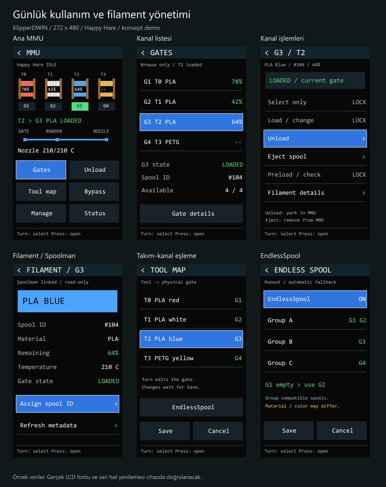
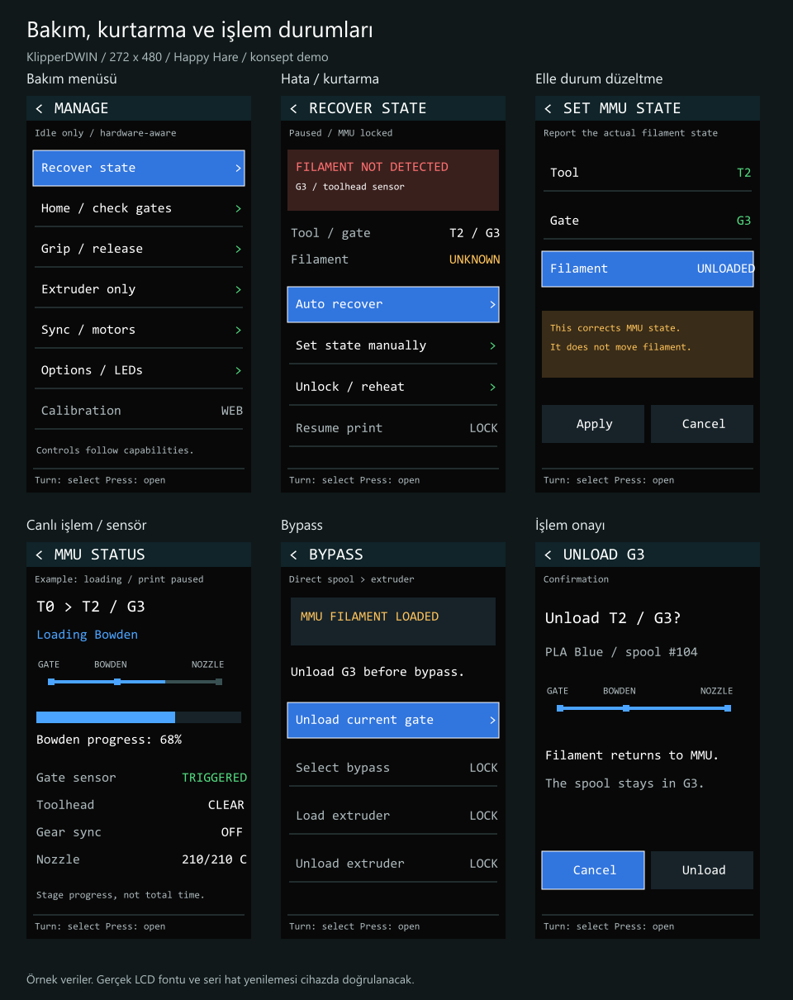

# MMU menüsü — tasarım demosu

**[Resimli kullanım rehberini aç →](tasarim-notlari.md)**

14 ekranın her biri, ne işe yaradığı ve encoder ile nasıl kullanılacağı rehberde açıklanıyor. Bu klasör tasarım önerisidir; MMU kontrol kodu henüz uygulanmadı.

PNG dosyaları önizlemeler, SVG dosyaları ölçeklenebilir görsel kaynaklarıdır. Görseller örnek veri içerir.
